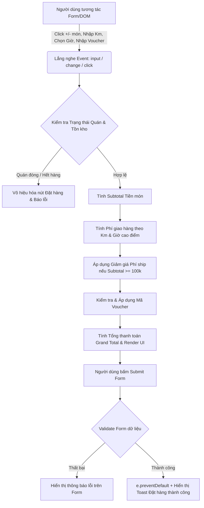

# Bài tập 9: FinTech (Mức độ 3: Nâng cao - Xây dựng tính năng mới)

### 1. Mục tiêu bài tập
- **Thành thạo Xử lý Sự kiện (Event Handling):** Lắng nghe và xử lý các sự kiện người dùng (`click`, `input`, `change`, `submit`) bằng `addEventListener` theo chuẩn ES6+.
- **Quản lý Form & Validation:** Thao tác với Form HTML, xử lý sự kiện `submit`, ngăn chặn hành vi mặc định của trình duyệt (`preventDefault`), kiểm tra tính hợp lệ dữ liệu đầu vào (Validation).
- **Tính toán Logic Nghiệp vụ FinTech/E-commerce:** Triển khai các thuật toán tính tiền giỏ hàng, tính phí giao hàng động (Dynamic Delivery Fee), áp dụng phụ phí giờ cao điểm, áp dụng voucher giảm giá và kiểm soát trạng thái tồn kho/cửa hàng.
- **Thao tác DOM Real-time:** Cập nhật giao diện người dùng (UI) tức thì khi có sự thay đổi từ bàn phím hoặc chuột của người dùng mà không cần tải lại trang.

---


### 2. Bối cảnh & Mô tả bài toán
Bạn là một Lập trình viên Frontend tại dự án **ShopeeFood**. Đội ngũ phát triển sản phẩm yêu cầu bạn xây dựng màn hình **"Tính toán Phí giao hàng & Xác nhận Đơn hàng Real-time"** cho ứng dụng web. 

Người dùng có thể tăng/giảm số lượng món ăn, nhập khoảng cách giao hàng, chọn khung giờ nhận hàng và nhập mã giảm giá. Hệ thống cần tính toán tức thì Phí giao hàng, Tiền giảm giá, Phụ phí giờ cao điểm và Tổng tiền thanh toán. Đồng thời, hệ thống phải chặn thao tác đặt hàng nếu quán đóng cửa hoặc số lượng món vượt quá tồn kho.


#### Sơ đồ Luồng Xử lý Sự kiện & Logic (Event & Data Flow)


---


### 3. Quy tắc Nghiệp vụ (Business Rules)


#### A. Trạng thái Cửa hàng & Quản lý Tồn kho (`FoodItem`)
1. **Trạng thái Cửa hàng (`isOpen`):** 
   - Nếu cửa hàng đóng cửa (`isOpen = false`), vô hiệu hóa nút "Đặt hàng" (disabled) và hiển thị thông báo: *"Cửa hàng hiện đang tạm đóng cửa."*
2. **Số lượng đặt (`quantity`) & Tồn kho (`stock`):**
   - Không cho phép giảm số lượng món xuống dưới `0`.
   - Nếu `quantity` đạt mức `stock` tối đa của món đó, vô hiệu hóa nút tăng số lượng `(+)` và hiển thị cảnh báo nhỏ bên cạnh món: *"Đã đạt số lượng tồn kho tối đa."*


#### B. Thuật toán Tính Phí giao hàng (`DeliveryFee`)
- **Khoảng cách (`distance` tính bằng km):** Làm tròn lên số nguyên gần nhất (Ví dụ: `2.1 km` -> `3 km`).
- **Mức phí cơ sở:**
  - 2 km đầu tiên: `15,000 VNĐ`.
  - Từ km thứ 3 trở đi: Cộng thêm `5,000 VNĐ / km`.
  - *Công thức:* `Phí cơ bản = 15,000 + MAX(0, ceil(distance) - 2) * 5,000`
- **Phụ phí Giờ Cao Điểm (`Peak Hour Surcharge`):**
  - Khung giờ cao điểm: `11:00 - 13:00` hoặc `18:00 - 20:00`.
  - Nếu người dùng chọn khung giờ này: Cộng thêm `10,000 VNĐ` vào phí giao hàng.
- **Chính sách Miễn/Giảm phí giao hàng:**
  - Nếu Tổng tiền món ăn (Subtotal) $\ge$ `100,000 VNĐ`: Giảm `15,000 VNĐ` phí giao hàng.
  - *Lưu ý:* Phí giao hàng sau khi giảm không được âm (tối thiểu là `0 VNĐ`).


#### C. Áp dụng Mã Giảm giá (`Voucher`)
Hệ thống hỗ trợ 2 mã giảm giá mặc định sau (Phân biệt chữ hoa/chữ thường):
1. **`SHOPEEFOOD50`**: Giảm 50% tổng tiền món ăn (Subtotal), giảm tối đa `30,000 VNĐ`.
2. **`FREESHIP`**: Giảm thêm `10,000 VNĐ` trực tiếp vào phí giao hàng.
- Nếu nhập mã không tồn tại: Hiển thị báo lỗi *"Mã giảm giá không hợp lệ"* ngay bên dưới ô nhập.


#### D. Công thức Tổng thanh toán (`Grand Total`)
$$\text{Grand Total} = \text{Subtotal} + \text{Phí Ship Thực tế} - \text{Mức Giảm Giá Voucher Món}$$
*(Trong đó Phí Ship Thực tế = $\max(0, \text{Phí cơ bản} + \text{Phụ phí giờ cao điểm} - \text{Giảm phí ship đơn 100k} - \text{Giảm ship từ Voucher})$)*

---


### 4. Yêu cầu Kỹ thuật & Triển khai


#### A. Trạng thái Dữ liệu Ban đầu (Mock State)
Học viên khai báo biến lưu trữ trạng thái dữ liệu trong file `script.js` (Không sử dụng LocalStorage hay Fetch API):

```javascript
const storeState = {
  isOpen: true,
  items: [
    { id: 1, name: "Cơm Tấm Sườn Bì Chả", price: 45000, stock: 5, quantity: 1 },
    { id: 2, name: "Trà Sữa Oolong Lài", price: 30000, stock: 3, quantity: 2 },
    { id: 3, name: "Bánh Mì Thịt Nướng", price: 25000, stock: 0, quantity: 0 }
  ],
  distanceKm: 3.5,
  deliveryTimeSlot: "normal", // "normal" hoặc "peak"
  voucherCode: ""
};
```


#### B. Cấu trúc Giao diện Form & Sự kiện cần Lắng nghe
1. **Form Đặt hàng (`<form id="order-form">`):**
   - Ô nhập Khoảng cách (`<input type="number" id="distance-input">`): Lắng nghe sự kiện `input`.
   - Selector Khung giờ (`<select id="time-slot-select">`): Lắng nghe sự kiện `change`.
   - Ô nhập Mã Voucher (`<input type="text" id="voucher-input">`): Lắng nghe sự kiện `input` hoặc nút "Áp dụng" (`click`).
   - Danh sách món ăn: Nút `(+)` và `(-)` cho từng món, lắng nghe sự kiện `click`.
   - Nút Submit (`<button type="submit" id="btn-submit">`): Lắng nghe sự kiện `submit` của Form.

2. **Yêu cầu xử lý Sự kiện chi tiết:**
   - **Thao tác Form Submit:** Bắt buộc dùng `e.preventDefault()` để chống reload trang.
   - **Xử lý Biên & Validation:**
     - Khoảng cách giao hàng phải $> 0$. Nếu $\le 0$ hoặc để trống, hiển thị báo lỗi bên dưới field: *"Khoảng cách giao hàng phải lớn hơn 0 km"*.
     - Giỏ hàng không được rỗng (Tổng `quantity` tất cả món $> 0$). Nếu bằng $0$, không cho phép submit và báo lỗi.
   - **Cập nhật UI (DOM Rendering):** Mỗi khi state thay đổi, gọi hàm update UI để tính lại toán bộ các con số: Subtotal, Shipping Fee, Discount Amount, Grand Total và trạng thái Disabled/Enabled của các nút bấm.

---


### 5. Quy chuẩn Nộp bài
- **Cấu trúc thư mục dự án:**
  ```text
  shopeefood-checkout/
  ├── index.html
  ├── style.css
  └── script.js
  ```
- **Quy định đặt tên:**
  - File HTML, CSS, JS đặt tên chính xác như trên.
  - Sử dụng cú pháp ES6 (`const`, `let`, Arrow Functions, Array Methods: `map`, `reduce`, `find`).
  - Phân chia mã nguồn JS thành các hàm có trách nhiệm riêng biệt: `calculateShippingFee()`, `calculateTotal()`, `renderCart()`, `handleFormSubmit()`.

### Tiêu chuẩn Đánh giá & Thang điểm (100đ)

| Tiêu chí | Điểm tối đa | Mô tả chi tiết đánh giá |
| :--- | :--- | :--- |
| **Cấu trúc & Phong cách mã nguồn** | **20 điểm** | - Đặt tên biến, hàm theo chuẩn `camelCase`, thể hiện rõ ngữ nghĩa.<br>- Tổ chức code sạch sẻ, tách biệt giữa phần xử lý Logic (State) và Render UI.<br>- Có comment giải thích chi tiết logic nghiệp vụ phức tạp (Công thức tính phí ship, giờ cao điểm). |
| **Xử lý Sự kiện & Form (DOM Events)** | **20 điểm** | - Lắng nghe đúng và đủ các sự kiện `input`, `change`, `click`, `submit` bằng `addEventListener`.<br>- Sử dụng `e.preventDefault()` chuẩn xác khi submit Form.<br>- Truy xuất và cập nhật các phần tử DOM mượt mà, đúng kỹ thuật. |
| **Tính đúng đắn Logic Nghiệp vụ** | **40 điểm** | - Tính đúng phí giao hàng theo khoảng cách làm tròn ($15k$ cho $2km$ đầu, $+5k/km$ tiếp theo).<br>- Cộng đúng phụ phí $10k$ khi chọn khung giờ cao điểm.<br>- Giảm đúng $15k$ phí ship cho đơn từ $100k$ (không âm phí ship).<br>- Áp dụng chính xác voucher `SHOPEEFOOD50` (tối đa $30k$) và `FREESHIP`.<br>- Khóa nút/chặn đặt hàng chuẩn xác khi cửa hàng đóng cửa (`isOpen = false`). |
| **Xử lý Biên & Ngoại lệ (Edge Cases)** | **10 điểm** | - Giới hạn số lượng món theo tồn kho (`stock`), không cho chọn quá stock hoặc âm số lượng.<br>- Báo lỗi rõ ràng khi khoảng cách nhập vào $\le 0$ hoặc giỏ hàng $0$ món.<br>- Xử lý đúng khi nhập mã voucher sai/không tồn tại. |
| **Giao diện & Tương tác UX** | **10 điểm** | - Hiển thị giá tiền dạng định dạng chuẩn VND (VD: `45,000 VNĐ`).<br>- Vô hiệu hóa (disabled) trực quan các nút tăng/giảm số lượng hoặc nút Submit khi không đủ điều kiện. |
| **TỔNG ĐIỂM** | **100 điểm** | **Đạt yêu cầu khi tổng điểm $\ge 70$ điểm.** |