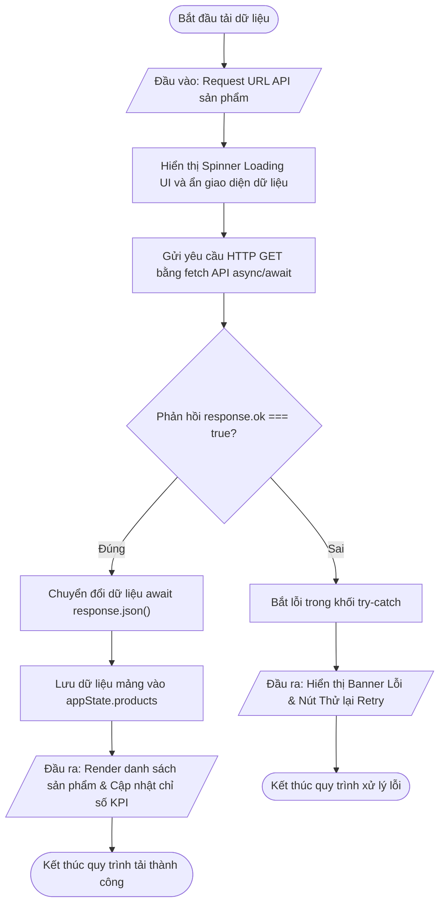
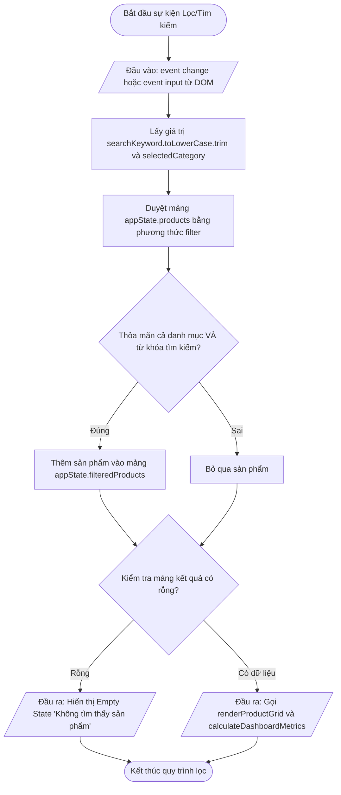
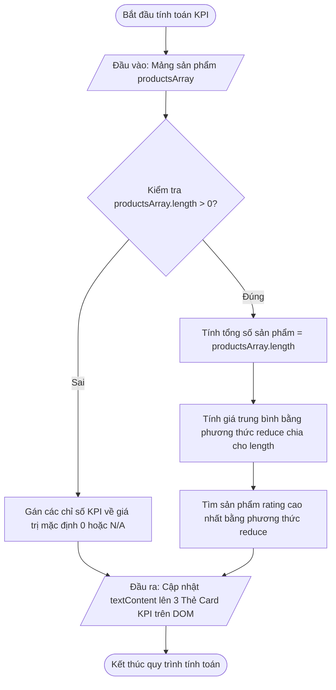
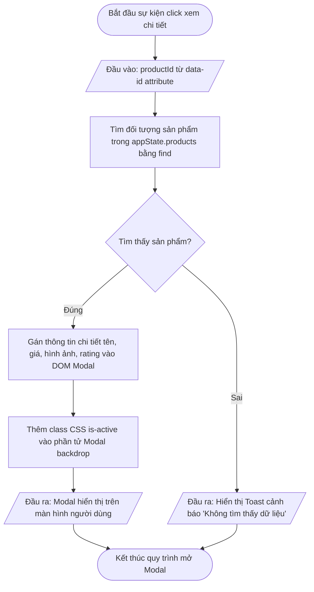

## <center>Tài liệu đặc tả Hệ thống Bảng điều khiển Quản lý & Phân tích Sản phẩm Dữ liệu Động (Dynamic Product Analytics Dashboard)</center>

### **1. Tổng quan hệ thống**

Hệ thống **Bảng điều khiển Quản lý & Phân tích Sản phẩm Dữ liệu Động (Dynamic Product Analytics Dashboard)** là ứng dụng Frontend Single Page Web Application (SPA) tương tác thời gian thực, cho phép người dùng quan sát, lọc, tìm kiếm và phân tích các chỉ số sản phẩm thương mại điện tử dựa trên dữ liệu cập nhật từ dịch vụ RESTful API bên ngoài.

Ứng dụng được xây dựng tối giản, tối ưu hiệu năng trên nền tảng **JavaScript Vanilla (ES6+)**, kết hợp **HTML5/CSS3 UI Components**, **DOM API**, và **Fetch API với cú pháp Async/Await**. Mọi dữ liệu thu thập từ HTTP response được quản lý tập trung trong bộ nhớ RAM (`appState`) và cập nhật tức thì lên các thành phần giao diện (Thẻ chỉ số KPI, Danh mục lọc, Thanh tìm kiếm, Grid danh sách sản phẩm, và Modal popup chi tiết) mà không làm tải lại trang web (No Reload).


---

### **2. Đặc tả chức năng (Functional Requirements)**

#### **Bảng tổng hợp danh mục chức năng hệ thống**

<table style="width: 100%; min-width: 100%; display: table; border-collapse: collapse;" width="100%" border="1" cellSpacing="0" cellPadding="6">
  <thead>
    <tr style="background-color: #f2f4f8; text-align: left;">
      <th style="width: 5%;">STT</th>
      <th style="width: 25%;">Tên Chức Năng & Hàm Handler</th>
      <th style="width: 35%;">Mô Tả Nghiệp Vụ</th>
      <th style="width: 15%;">Dữ Liệu Đầu Vào (Input)</th>
      <th style="width: 20%;">Kết Quả Đầu Ra (Output)</th>
    </tr>
  </thead>
  <tbody>
    <tr>
      <td>1</td>
      <td><b>[Tải dữ liệu từ API Bất đồng bộ]</b><br><code>fetchProductList()</code></td>
      <td>Thực hiện cuộc gọi HTTP GET bất đồng bộ tới REST API để lấy danh sách mảng đối tượng sản phẩm. Quản lý trạng thái Skeleton Loading và bắt lỗi Network/HTTP Error.</td>
      <td>API Endpoint URL string</td>
      <td>Cập nhật <code>appState.products</code>, render danh sách và kích hoạt tính toán KPI.</td>
    </tr>
    <tr>
      <td>2</td>
      <td><b>[Tính toán Chỉ số Thống kê KPI]</b><br><code>calculateDashboardMetrics()</code></td>
      <td>Duyệt mảng sản phẩm hiện tại trong bộ nhớ để tính toán Tổng số lượng, Giá trung bình, và Sản phẩm có điểm đánh giá (Rating) cao nhất bằng các phương thức duyệt mảng ES6.</td>
      <td>Mảng đối tượng sản phẩm <code>productsArray</code></td>
      <td>Cập nhật nội dung textContent của 3 thẻ KPI trên giao diện DOM.</td>
    </tr>
    <tr>
      <td>3</td>
      <td><b>[Hiển thị Danh sách Card Sản phẩm DOM]</b><br><code>renderProductGrid()</code></td>
      <td>Xóa danh sách cũ và dựng lại dynamic HTML card cho từng sản phẩm trong mảng được truyền vào thông qua thao tác DOM <code>innerHTML</code> hoặc <code>appendChild</code>.</td>
      <td>Mảng sản phẩm đã lọc <code>filteredArray</code></td>
      <td>Giao diện Grid chứa danh sách thẻ sản phẩm đầy đủ thông tin (Ảnh, Tên, Giá, Đánh giá).</td>
    </tr>
    <tr>
      <td>4</td>
      <td><b>[Lọc Dữ liệu theo Danh mục & Từ khóa]</b><br><code>filterProducts()</code></td>
      <td>Lắng nghe sự kiện <code>change</code> từ Dropdown danh mục và sự kiện <code>input</code> từ Thanh tìm kiếm để lọc mảng sản phẩm theo các tiêu chí kết hợp.</td>
      <td><code>selectedCategory</code>, <code>searchKeyword</code></td>
      <td>Mảng sản phẩm thỏa điều kiện <code>appState.filteredProducts</code> và gọi re-render UI + KPI.</td>
    </tr>
    <tr>
      <td>5</td>
      <td><b>[Xem Chi tiết Sản phẩm Modal Popup]</b><br><code>showProductDetailModal()</code></td>
      <td>Khi người dùng nhấn nút "Xem Chi Tiết" trên card, truy xuất thông tin chi tiết đối tượng sản phẩm từ mảng và bật cửa sổ Modal Popup overlay.</td>
      <td><code>productId</code> (number/string)</td>
      <td>Hiển thị Modal Popup chứa đầy đủ mô tả, tồn kho, thương hiệu và nút Đóng modal.</td>
    </tr>
    <tr>
      <td>6</td>
      <td><b>[Xử lý Trạng thái Tải & Lỗi UI API]</b><br><code>handleApiState()</code></td>
      <td>Điều khiển bật/tắt lớp hiển thị Spinner Loading và Banner cảnh báo lỗi khi cuộc gọi Fetch API gặp sự cố mất mạng hoặc phản hồi HTTP không hợp lệ.</td>
      <td><code>stateType</code> ('loading' | 'error' | 'success'), <code>errorMessage</code></td>
      <td>Bật/Tắt các thành phần DOM tương ứng với trạng thái phản hồi của hệ thống.</td>
    </tr>
  </tbody>
</table>

---

#### **Chi tiết từng chức năng nghiệp vụ & Sơ đồ luồng**

##### **2.1. Chức năng Tải dữ liệu bất đồng bộ (`fetchProductList`)**

* **Mô tả nghiệp vụ:** Khi ứng dụng khởi chạy (`DOMContentLoaded`), hàm bất đồng bộ `fetchProductList()` được gọi tự động. Hàm gửi yêu cầu `fetch()` với cấu hình `async/await`. Nếu nhận mã HTTP 200 OK, parse dữ liệu JSON và lưu trữ vào `appState.products`. Khi kết nối thất bại hoặc phản hồi lỗi HTTP 4xx/5xx, ứng dụng hiển thị UI cảnh báo lỗi và nút "Thử Lại" (Retry).
* **Sơ đồ 2.1: Luồng nghiệp vụ Tải dữ liệu API**



* **Mock I/O Test Case (`fetchProductList`):**
  * **Dữ liệu đầu vào mẫu:** Endpoint API: `https://dummyjson.com/products?limit=10`.
  * **Kết quả đầu ra kỳ vọng:** 
    * `appState.products` chứa 10 đối tượng sản phẩm dạng JSON.
    * Giao diện ẩn Spinner Loading, hiển thị 10 thẻ card sản phẩm lên Grid.
    * Thẻ KPI hiển thị đúng số liệu tính toán.
  * **Kịch bản xử lý lỗi (Edge Case & Error Handling):** 
    * *Đầu vào:* URL API bị sai hoặc ngắt kết nối Internet (NetworkError).
    * *Xử lý & Cảnh báo:* Khối `catch(error)` bắt được ngoại lệ `TypeError: Failed to fetch`.
    * *Thông báo giao diện:* Hiển thị Banner Lỗi với thông tin `"Không thể kết nối đến máy chủ API. Vui lòng kiểm tra lại đường truyền mạng!"` kèm nút `[Thử lại]`.

---

##### **2.2. Chức năng Lọc & Tìm kiếm Sản phẩm (`filterProducts`)**

* **Mô tả nghiệp vụ:** Người dùng nhập từ khóa vào ô tìm kiếm (`<input id="searchInput">`) hoặc chọn danh mục từ dropdown (`<select id="categorySelect">`). Hàm `filterProducts()` sẽ lấy giá trị từ hai phần tử DOM này, dùng phương thức `.filter()` và `.includes()` để lọc mảng sản phẩm gốc `appState.products`, thu được mảng kết quả `appState.filteredProducts` và cập nhật lại giao diện.
* **Sơ đồ 2.2: Luồng nghiệp vụ Lọc và Tìm kiếm**



* **Mock I/O Test Case (`filterProducts`):**
  * **Dữ liệu đầu vào mẫu:** `selectedCategory = "beauty"`, `searchKeyword = "powder"`.
  * **Kết quả đầu ra kỳ vọng:** 
    * Mảng `filteredProducts` thu được 1 sản phẩm thỏa mãn chứa tên "Essence Mascara Lash Princess" hoặc "Powder Canmake".
    * Danh sách Card trên UI chỉ hiển thị sản phẩm thuộc danh mục "beauty" và tên có chứa "powder".
    * Thẻ KPI Tổng số lượng cập nhật lại bằng `1`.
  * **Kịch bản xử lý lỗi (Edge Case & Error Handling):** 
    * *Đầu vào:* `searchKeyword = "xyz12345nonexist"`.
    * *Xử lý & Cảnh báo:* Mảng `filteredProducts` có độ dài `length === 0`.
    * *Thông báo giao diện:* Khung giao diện Grid hiển thị thông báo Empty State: `"Không tìm thấy sản phẩm nào phù hợp với từ khóa 'xyz12345nonexist'"`.

---

##### **2.3. Chức năng Tính toán Chỉ số KPI Dashboard (`calculateDashboardMetrics`)**

* **Mô tả nghiệp vụ:** Mỗi khi mảng sản phẩm hiển thị bị thay đổi (tải ban đầu hoặc sau khi lọc/tìm kiếm), hàm `calculateDashboardMetrics()` được thực thi với mảng sản phẩm hiện tại. Hàm tính toán 3 tham số thống kê và ghi trực tiếp vào thuộc tính `.textContent` của các DOM node tương ứng:
  1. *Total Products:* Độ dài mảng `productsArray.length`.
  2. *Average Price:* Tổng giá trị bán của mảng tính qua phương thức `.reduce()` chia cho tổng số lượng sản phẩm (định dạng thành tiền tệ USD/VND).
  3. *Top Rated Product:* Sản phẩm có `rating` cao nhất tính qua phương thức `.reduce()`.
* **Sơ đồ 2.3: Luồng nghiệp vụ Tính toán KPI Dashboard**



* **Mock I/O Test Case (`calculateDashboardMetrics`):**
  * **Dữ liệu đầu vào mẫu:** 
    `productsArray = [{id: 1, price: 10, rating: 4.5}, {id: 2, price: 30, rating: 4.9}]`.
  * **Kết quả đầu ra kỳ vọng:** 
    * `totalProductsText.textContent = "2"`.
    * `averagePriceText.textContent = "$20.00"`.
    * `topRatedProductText.textContent = "ID #2 (Rating: 4.9)"`.
  * **Kịch bản xử lý lỗi (Edge Case & Error Handling):** 
    * *Đầu vào:* `productsArray = []` (Mảng rỗng).
    * *Xử lý & Cảnh báo:* Tránh lỗi chia cho 0 (`NaN`).
    * *Thông báo giao diện:* `totalProductsText = "0"`, `averagePriceText = "$0.00"`, `topRatedProductText = "N/A"`.

---

##### **2.4. Chức năng Xem Chi tiết Sản phẩm Modal Popup (`showProductDetailModal`)**

* **Mô tả nghiệp vụ:** Khi người dùng click nút "Chi Tiết" trên bất kỳ Card sản phẩm nào, một sự kiện `click` được kích hoạt truyền `productId`. Hàm dùng phương thức `.find()` để tìm sản phẩm tương ứng trong `appState.products`, điền dữ liệu vào các thẻ của Modal và thêm lớp CSS `is-active` để hiển thị cửa sổ overlay.
* **Sơ đồ 2.4: Luồng nghiệp vụ Hiển thị Modal Chi tiết**



* **Mock I/O Test Case (`showProductDetailModal`):**
  * **Dữ liệu đầu vào mẫu:** `productId = 5`.
  * **Kết quả đầu ra kỳ vọng:** 
    * Modal hiển thị thông tin sản phẩm có `id = 5`.
    * Lớp phủ backdrop đen mờ xuất hiện làm nổi bật Modal.
    * Nút đóng modal `[X]` hoặc click ngoài backdrop gỡ bỏ class `is-active` và ẩn Modal.
  * **Kịch bản xử lý lỗi (Edge Case & Error Handling):** 
    * *Đầu vào:* `productId` không tồn tại trong bộ nhớ (VD: `productId = 9999`).
    * *Xử lý & Cảnh báo:* Phương thức `.find()` trả về `undefined`.
    * *Thông báo giao diện:* Không mở Modal, hiển thị Toast cảnh báo: `"Lỗi: Không tìm thấy dữ liệu chi tiết cho sản phẩm này!"`.

---

### **3. Đặc tả phi chức năng (Non-Functional Requirements)**

<table style="width: 100%; min-width: 100%; display: table; border-collapse: collapse;" width="100%" border="1" cellSpacing="0" cellPadding="6">
  <thead>
    <tr style="background-color: #f2f4f8; text-align: left;">
      <th style="width: 20%;">Tiêu Chí (Category)</th>
      <th style="width: 40%;">Tên Yêu Cầu & Tiêu Chuẩn Giới Hạn</th>
      <th style="width: 40%;">Phương Pháp Kiểm Tra / Đo Lường</th>
    </tr>
  </thead>
  <tbody>
    <tr>
      <td><b>Hiệu năng (Performance)</b></td>
      <td>
        - Thời gian phản hồi render DOM sau khi nhận API data &lt; 200ms.<br>
        - Lọc và cập nhật UI thời gian thực khi người dùng gõ phím &lt; 100ms.<br>
        - Gọi HTTP API bất đồng bộ không gây đóng băng (non-blocking) luồng UI chính.
      </td>
      <td>Sử dụng Chrome DevTools Performance tab đo FPS và CPU Main Thread Execution time khi filter mảng 100 phần tử.</td>
    </tr>
    <tr>
      <td><b>Giao diện & Trải nghiệm (UI/UX)</b></td>
      <td>
        - Thiết kế Responsive Grid linh hoạt tương thích màn hình Desktop (&gt;1024px), Tablet (768px - 1023px) và Mobile (&lt;767px).<br>
        - Phải có trạng thái Skeleton Loading khi chờ gọi Fetch API.<br>
        - Màu sắc đồng bộ chuẩn Corporate Flat 2D (Navy, Slate Gray, Soft Emerald).
      </td>
      <td>Kiểm tra hiển thị trực quan trên Device Mode của IDE/Trình duyệt ở các kích thước độ phân giải phổ biến.</td>
    </tr>
    <tr>
      <td><b>Độ tin cậy (Reliability)</b></td>
      <td>
        - Khả năng tự phục hồi (Graceful Degradation): Hệ thống không bị treo màn hình trắng khi API bị lỗi mạng hoặc HTTP 500.<br>
        - Hiển thị Banner cảnh báo lỗi rõ ràng kèm cơ chế Thử lại (Retry Call) mà không cần F5 reload trang.
      </td>
      <td>Mô phỏng ngắt kết nối mạng (Offline Mode) trong Network tab của Chrome DevTools và gọi API.</td>
    </tr>
    <tr>
      <td><b>Mã nguồn Clean Code (Maintainability)</b></td>
      <td>
        - Mã nguồn viết bằng ES6+ Vanilla JS thuần, tuân thủ nguyên tắc Single Responsibility (Mỗi hàm làm đúng 1 nhiệm vụ).<br>
        - Biến và hàm đặt tên 100% Tiếng Anh chuẩn camelCase.<br>
        - Không sử dụng các thư viện ngoài (React, jQuery, Lodash) hoặc các API lưu trữ nâng cao chưa học (LocalStorage).
      </td>
      <td>Đánh giá mã nguồn theo quy chuẩn Clean Code ES6 và kiểm định phụ thuộc (Zero Dependencies).</td>
    </tr>
  </tbody>
</table>

---

### **4. Đặc tả dữ liệu & State Management (State & Component Models)**

Hệ thống quản lý toàn bộ trạng thái hoạt động trong một Đối tượng JavaScript duy nhất duy trì trong bộ nhớ RAM (`in-memory global state`) trong suốt phiên làm việc của người dùng.

#### **4.1. Sơ đồ Cấu trúc State Lưu trữ Bộ nhớ (`appState`)**

```json
{
  "products": [
    {
      "id": 1,
      "title": "Essence Mascara Lash Princess",
      "category": "beauty",
      "price": 9.99,
      "rating": 4.94,
      "stock": 5,
      "thumbnail": "https://cdn.dummyjson.com/products/images/beauty/Essence%20Mascara%20Lash%20Princess/thumbnail.png",
      "description": "The Essence Mascara Lash Princess is a popular mascara known for its volumizing effect."
    }
  ],
  "filteredProducts": [],
  "categories": ["all", "beauty", "fragrances", "furniture", "groceries"],
  "selectedCategory": "all",
  "searchKeyword": "",
  "selectedProductDetail": null,
  "uiState": {
    "isLoading": false,
    "errorMessage": null
  }
}
```

#### **4.2. Mô hình Ánh xạ Thành phần DOM (Dynamic DOM Binding Schema)**

<table style="width: 100%; min-width: 100%; display: table; border-collapse: collapse;" width="100%" border="1" cellSpacing="0" cellPadding="6">
  <thead>
    <tr style="background-color: #f2f4f8; text-align: left;">
      <th style="width: 25%;">Tên Thành Phần UI</th>
      <th style="width: 25%;">DOM Selector Element ID/Class</th>
      <th style="width: 25%;">Nguồn Dữ Liệu Lắng Nghe</th>
      <th style="width: 25%;">Sự Kiện Lắng Nghe (Event)</th>
    </tr>
  </thead>
  <tbody>
    <tr>
      <td>Thẻ KPI Tổng Số Lượng</td>
      <td><code>#totalProductsMetric</code></td>
      <td><code>appState.filteredProducts.length</code></td>
      <td>Re-render tự động khi State thay đổi</td>
    </tr>
    <tr>
      <td>Thẻ KPI Giá Trung Bình</td>
      <td><code>#averagePriceMetric</code></td>
      <td><code>calculateAveragePrice()</code></td>
      <td>Re-render tự động khi State thay đổi</td>
    </tr>
    <tr>
      <td>Thẻ KPI Đánh Giá Cao Nhất</td>
      <td><code>#topRatedMetric</code></td>
      <td><code>findTopRatedProduct()</code></td>
      <td>Re-render tự động khi State thay đổi</td>
    </tr>
    <tr>
      <td>Thanh Tìm Kiếm Từ Khóa</td>
      <td><code>#searchInput</code></td>
      <td><code>appState.searchKeyword</code></td>
      <td><code>input</code> (real-time filter)</td>
    </tr>
    <tr>
      <td>Dropdown Chọn Danh Mục</td>
      <td><code>#categorySelect</code></td>
      <td><code>appState.categories</code></td>
      <td><code>change</code> (filter list)</td>
    </tr>
    <tr>
      <td>Lưới Khung Danh Sách</td>
      <td><code>#productGridContainer</code></td>
      <td><code>appState.filteredProducts</code></td>
      <td>Re-render qua <code>innerHTML</code></td>
    </tr>
    <tr>
      <td>Modal Popup Chi Tiết</td>
      <td><code>#productDetailModal</code></td>
      <td><code>appState.selectedProductDetail</code></td>
      <td><code>click</code> vào nút Xem Chi Tiết / Đóng Modal</td>
    </tr>
  </tbody>
</table>

---

### **5. Quy tắc Kiểm chuẩn Giao diện & Cảnh báo UI (UI Validation & Toast Notifications)**

#### **5.1. Quy tắc Kiểm chuẩn Dữ liệu Đầu vào Giao diện (UI Form Validation Rules)**
1. **Ô Tìm Kiếm Từ Khóa (`#searchInput`):**
   * Tự động cắt bỏ khoảng trắng thừa đầu và cuối chuỗi bằng `.trim()`.
   * Chuyển tất cả ký tự nhập vào về dạng chữ thường `.toLowerCase()` để tìm kiếm không phân biệt hoa thường.
   * Nếu người dùng xóa sạch ô tìm kiếm, tự động khôi phục danh sách theo danh mục đang chọn.

2. **Dropdown Chọn Danh Mục (`#categorySelect`):**
   * Giá trị mặc định luôn là `"all"` (Tất cả danh mục).
   * Khi chọn danh mục cụ thể, danh sách lọc sẽ là tập giao thỏa mãn cả danh mục chọn và từ khóa đang nhập.

#### **5.2. Quy tắc Cảnh báo Trạng thái UI (Loading, Error Banner & Toast Notifications)**
1. **Trạng thái Đang Tải (`Loading State`):**
   * Trong lúc lệnh `fetch()` đang xử lý, hiển thị 6 thẻ Card Skeleton mờ xám chuyển động hoặc phần tử Spinner ở tâm màn hình.
   * Vô hiệu hóa nút Lọc và ô Tìm kiếm trong quá trình Loading để tránh xung đột thao tác người dùng.

2. **Trạng thái Cảnh báo Lỗi API (`Error State`):**
   * Nếu Fetch API bị rejected hoặc trả về HTTP status `>= 400`, ẩn toàn bộ grid danh sách và hiển thị một Banner Lỗi trung tâm:
     * *Icon:* ⚠️
     * *Tiêu đề:* `"Không thể tải dữ liệu sản phẩm"`
     * *Nội dung:* `"Đã có lỗi xảy ra khi kết nối tới máy chủ. Vui lòng thử lại!"`
     * *Nút hành động:* Nút `[Thử lại (Retry)]` kích hoạt lại hàm `fetchProductList()`.

3. **Thông báo Toast Cảnh báo Ngắn (`Toast Notifications`):**
   * Hiển thị ở góc trên bên phải màn hình trong 3 giây khi thực hiện các hành động nhanh (Ví dụ: Đóng Modal chi tiết, bấm nút lọc không có kết quả).

---

### **6. Bảng tổng hợp tình huống lỗi UI (UI Edge Cases Mapping)**

<table style="width: 100%; min-width: 100%; display: table; border-collapse: collapse;" width="100%" border="1" cellSpacing="0" cellPadding="6">
  <thead>
    <tr style="background-color: #f2f4f8; text-align: left;">
      <th style="width: 5%;">STT</th>
      <th style="width: 25%;">Tình Huống Lỗi Nghiệp Vụ (Edge Case)</th>
      <th style="width: 25%;">Nguyên Nhân Hệ Thống</th>
      <th style="width: 25%;">Giải Pháp Xử Lý Kỹ Thuật</th>
      <th style="width: 20%;">Thông Điệp Hiển Thị UI</th>
    </tr>
  </thead>
  <tbody>
    <tr>
      <td>1</td>
      <td>Mất kết nối mạng khi ứng dụng đang tải dữ liệu.</td>
      <td>Hàm <code>fetch()</code> ném ra ngoại lệ <code>TypeError</code> do đứt kết nối Internet.</td>
      <td>Bắt khối <code>catch(error)</code>, hủy trạng thái Spinner Loading, bật Banner Lỗi giao diện.</td>
      <td><i>"Lỗi kết nối mạng. Vui lòng kiểm tra lại Wifi/Internet của bạn!"</i></td>
    </tr>
    <tr>
      <td>2</td>
      <td>API phản hồi mã lỗi HTTP 500 (Internal Server Error).</td>
      <td>Máy chủ API gặp sự cố xử lý bên phía Backend.</td>
      <td>Kiểm tra <code>!response.ok</code>, throw Error thủ công để nhảy vào khối <code>catch</code>.</td>
      <td><i>"Máy chủ API đang gặp sự cố (HTTP 500). Vui lòng thử lại sau!"</i></td>
    </tr>
    <tr>
      <td>3</td>
      <td>Từ khóa tìm kiếm không trùng khớp với bất kỳ sản phẩm nào.</td>
      <td>Mảng sau khi lọc <code>filteredProducts.length === 0</code>.</td>
      <td>Gán HTML của Grid Container thành giao diện Empty State hình minh họa và thông báo nhẹ.</td>
      <td><i>"Không tìm thấy sản phẩm nào phù hợp với từ khóa của bạn."</i></td>
    </tr>
    <tr>
      <td>4</td>
      <td>Đường dẫn ảnh sản phẩm (thumbnail URL) bị lỗi hỏng (Broken Link).</td>
      <td>URL hình ảnh từ API trả về bị lỗi 404 hoặc đường dẫn không hợp lệ.</td>
      <td>Đăng ký sự kiện <code>onerror</code> cho thẻ <code>&lt;img&gt;</code> để thay thế bằng ảnh placeholder mặc định.</td>
      <td>Hiển thị ảnh thay thế chuẩn <i>"Image Not Available"</i>.</td>
    </tr>
    <tr>
      <td>5</td>
      <td>Dữ liệu giá hoặc rating bị thiếu/null từ API.</td>
      <td>Đối tượng JSON trả về không chứa field <code>price</code> hoặc <code>rating</code>.</td>
      <td>Sử dụng Default Parameters hoặc toán tử Nullish Coalescing (<code>product.price ?? 0</code>).</td>
      <td>Hiển thị <i>"$0.00"</i> hoặc <i>"Rating: N/A"</i>.</td>
    </tr>
  </tbody>
</table>

---

### **7. Kịch bản Kiểm thử Tương tác Người dùng (User Interaction Test Flows)**

#### **Kịch bản 1: Kiểm thử Khởi chạy ứng dụng và Tải dữ liệu ban đầu thành công**
* **Mục tiêu:** Kiểm tra luồng gọi Fetch API bất đồng bộ và tự động render dữ liệu lên DOM khi vào trang web.
* **Các bước thực hiện:**
  1. Người dùng mở trang web trên trình duyệt (`index.html`).
  2. Quan sát giao diện trong thời gian chờ API phản hồi.
  3. Quan sát giao diện sau khi API hoàn tất trả dữ liệu.
* **Kỳ vọng hệ thống:**
  * Tại bước 2: Spinner Loading hiển thị, ô tìm kiếm bị disabled.
  * Tại bước 3: Spinner ẩn đi, các thẻ KPI hiển thị chính xác tổng số lượng sản phẩm, giá trung bình và top rating. Đầy đủ danh sách các thẻ Card sản phẩm hiển thị trên khung Grid.

---

#### **Kịch bản 2: Kiểm thử Lọc sản phẩm kết hợp Lọc danh mục và Tìm kiếm từ khóa**
* **Mục tiêu:** Kiểm tra tính chính xác của hàm `filterProducts()` và khả năng tính toán lại KPI Dashboard theo mảng đã lọc.
* **Các bước thực hiện:**
  1. Người dùng chọn Danh mục `"beauty"` từ Dropdown Lọc Danh Mục.
  2. Người dùng nhập từ khóa `"mascara"` vào Thanh Tìm Kiếm.
  3. Quan sát danh sách sản phẩm hiển thị và số liệu 3 thẻ KPI.
* **Kỳ vọng hệ thống:**
  * Khung Grid chỉ hiển thị các sản phẩm vừa thuộc danh mục `"beauty"` vừa có tên chứa từ `"mascara"`.
  * Thẻ KPI "Tổng số lượng" cập nhật số liệu bằng chính số lượng card hiển thị.
  * Thẻ KPI "Giá trung bình" tự động tính lại dựa trên danh sách các sản phẩm đang hiển thị.

---

#### **Kịch bản 3: Kiểm thử Tương tác Mở & Đóng Modal Chi tiết Sản phẩm**
* **Mục tiêu:** Kiểm tra khả năng truy xuất đúng đối tượng sản phẩm và điều khiển lớp học CSS Modal DOM.
* **Các bước thực hiện:**
  1. Người dùng click vào nút `"Xem Chi Tiết"` trên một sản phẩm bất kỳ (VD: Sản phẩm ID #3).
  2. Quan sát thông tin hiển thị trên Popup Modal overlay.
  3. Click nút đóng `[X]` hoặc click ra ngoài vùng nền mờ Backdrop.
* **Kỳ vọng hệ thống:**
  * Modal Popup hiển thị mượt mà với đầy đủ hình ảnh phóng to, tiêu đề, danh mục, giá bán, tồn kho và mô tả chi tiết của đúng sản phẩm ID #3.
  * Khi click nút đóng `[X]`, Modal lập tức ẩn đi, giao diện trở về trạng thái danh sách bình thường.

---

#### **Kịch bản 4: Kiểm thử Xử lý Lỗi và Tính năng Thử lại (Retry Call) khi API Thất bại**
* **Mục tiêu:** Đảm bảo ứng dụng không bị crash và người dùng có thể khôi phục trạng thái ứng dụng khi gặp sự cố mạng.
* **Các bước thực hiện:**
  1. Mở DevTools, bật chế độ `Offline` trong tab Network.
  2. Reload lại trang hoặc click nút `"Thử lại"`.
  3. Quan sát Banner Lỗi hiển thị.
  4. Tắt chế độ `Offline` (Trở lại Online) và click nút `"Thử lại"`.
* **Kỳ vọng hệ thống:**
  * Tại bước 3: Banner Cảnh báo Lỗi hiển thị rõ ràng, báo lỗi đứt kết nối mạng và cung cấp nút `[Thử lại]`. Không có lỗi crash ứng dụng trên Console.
  * Tại bước 4: Sau khi khôi phục mạng và bấm `[Thử lại]`, ứng dụng thực hiện cuộc gọi `fetchProductList()` mới thành công và hiển thị lại toàn bộ dữ liệu Dashboard bình thường.