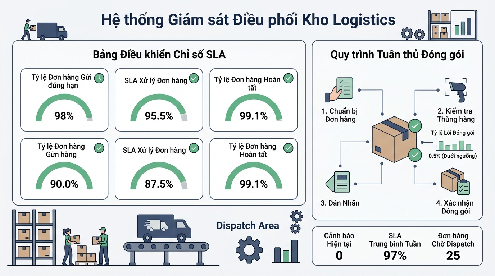

## <center>[Vận dụng cơ bản 1] Sửa lỗi hệ thống đánh giá chỉ số SLA vận chuyển Logistics</center>

### **1. Mục tiêu**
*   Phát hiện và phân tích lỗi logic trong script kiểm tra chỉ số SLA (Service Level Agreement) của đơn hàng vận tải trong hệ thống quản lý kho Logistics (WMS).
*   Áp dụng chuẩn công thức tính điểm tổng hợp theo trọng số (20% Chất lượng bao bì, 30% Tốc độ vận tải, 50% Mức độ hài lòng khách hàng) và ràng buộc giám sát lộ trình GPS đạt tối thiểu 80%.
*   Xây dựng báo cáo chẩn đoán lỗi dạng bảng Test Case và tái cấu trúc mã nguồn (refactoring) đáp ứng tiêu chuẩn dữ liệu doanh nghiệp.

### **2. Bối cảnh & Vấn đề**
Doanh nghiệp vận tải "LogiExpress" đang nâng cấp hệ thống quản lý đơn hàng Logistics. Để đảm bảo chất lượng dịch vụ, hệ thống cần tự động đánh giá đơn hàng hoàn thành xem có đạt chuẩn đầu ra SLA hay không.

Lập trình viên tập sự đã viết mã nguồn tính điểm SLA cho đơn hàng, tuy nhiên hệ thống đang gặp sự cố nghiêm trọng: Nhiều đơn hàng thiếu giám sát hành trình GPS (dưới 80% số checkpoint) hoặc có chỉ số thực tế kém vẫn được hệ thống ghi nhận là "ĐẠT CHUẨN VẬN HÀNH (SLA)". Qua rà soát, đoạn mã đang mắc các lỗi cơ bản như tính trung bình cộng bằng nhau thay vì tính theo trọng số nghiệp vụ, và bỏ qua điều kiện kiểm định an toàn hành trình.


<p align="center">
  
</p>


### **3. Mã nguồn hiện tại**
Dưới đây là mã nguồn đang chạy sai quy tắc nghiệp vụ trong hệ thống WMS của doanh nghiệp:

```javascript
// BÀI TẬP DEBUG: Mã nguồn đánh giá chỉ số SLA vận chuyển đang bị lỗi logic
class ShipmentEvaluationEngine {
  constructor(shipmentCode, totalRouteCheckpoints) {
    this.shipmentCode = shipmentCode;
    this.totalRouteCheckpoints = totalRouteCheckpoints;
  }

  // BẪY LỖI 1: Tính trung bình cộng đơn giản, bỏ qua trọng số nghiệp vụ (20% - 30% - 50%)
  calculateFinalScore(packagingScore, transitScore, satisfactionScore) {
    const totalScore = (packagingScore + transitScore + satisfactionScore) / 3;
    return totalScore; // Không làm tròn 2 chữ số thập phân
  }

  verifySLACompletion(finalScore, monitoredCheckpoints) {
    // BẪY LỖI 2: Bỏ qua kiểm tra điều kiện giám sát GPS tối thiểu 80% số checkpoint hành trình
    const isPassed = finalScore >= 5.0;

    return {
      shipmentCode: this.shipmentCode,
      finalScore: finalScore,
      monitoredCheckpoints: monitoredCheckpoints,
      isPassed: isPassed,
      statusMessage: isPassed ? "ĐẠT CHUẨN VẬN HÀNH (SLA)" : "KHÔNG ĐẠT CHUẨN VẬN HÀNH"
    };
  }
}

// Mô phỏng chạy thử nghiệm với đơn hàng LOG-8821
const engine = new ShipmentEvaluationEngine("LOG-8821", 10);

// Điểm đánh giá: Packaging = 9.0, Transit = 7.5, Satisfaction = 8.0; Giám sát thực tế: 7/10 checkpoint (70%)
const shipmentScore = engine.calculateFinalScore(9.0, 7.5, 8.0);
const result = engine.verifySLACompletion(shipmentScore, 7);

console.log("# Output:");
console.log(`Mã đơn hàng: ${result.shipmentCode}`);
console.log(`Điểm SLA tổng kết: ${result.finalScore}`);
console.log(`Số checkpoint giám sát: ${result.monitoredCheckpoints}/10`);
console.log(`Trạng thái: ${result.statusMessage}`);
```

### **4. Yêu cầu bài toán**

#### **Phần 1: Báo cáo chẩn đoán lỗi (Diagnostic Test Case Report)**
Lập bảng chẩn đoán lỗi kiểm thử gồm tối thiểu 3 trường hợp (Test Cases) thể hiện sai sót của mã nguồn hiện tại so với kỳ vọng nghiệp vụ. Yêu cầu sử dụng bảng HTML có thuộc tính định dạng chuẩn:

```html
<table style="width: 100%; min-width: 100%; display: table; border-collapse: collapse;" width="100%" border="1">
  <thead>
    <tr>
      <th>STT</th>
      <th>Dữ liệu đầu vào (Input)</th>
      <th>Kết quả lỗi thực tế (Actual Buggy Output)</th>
      <th>Kết quả kỳ vọng đúng (Expected Output)</th>
    </tr>
  </thead>
  <tbody>
    <!-- Học viên điền tối thiểu 3 test cases vào đây -->
  </tbody>
</table>
```

#### **Phần 2: Tái cấu trúc và sửa lỗi mã nguồn (Refactoring)**
Viết lại lớp `ShipmentEvaluationEngine` bằng JavaScript đảm bảo tuân thủ đúng các quy tắc nghiệp vụ sau:
1. Khai báo thuộc tính `weights` trong constructor lưu trữ trọng số: `packaging: 0.20`, `transit: 0.30`, `satisfaction: 0.50`.
2. Hàm `calculateFinalScore`: Tính điểm SLA theo công thức trọng số:
   `TotalScore = (packagingScore * 0.20) + (transitScore * 0.30) + (satisfactionScore * 0.50)`
   Kết quả trả về phải được làm tròn chính xác 2 chữ số thập phân dạng `Number`.
3. Hàm `verifySLACompletion`: Đơn hàng chỉ được ghi nhận `isPassed = true` khi đồng thời thỏa mãn 2 điều kiện:
   * Điểm tổng kết SLA (`finalScore`) $\ge 5.0$.
   * Số checkpoint được giám sát (`monitoredCheckpoints`) $\ge 80\%$ tổng số checkpoint lộ trình (`totalRouteCheckpoints * 0.8`).
4. Chạy kiểm thử mã nguồn đã sửa với 2 đơn hàng mẫu để kiểm chứng kết quả:
   * **Đơn hàng LOG-8821**: Total checkpoints = 10, Monitored = 7, Scores = (9.0, 7.5, 8.0) `\rightarrow` Kỳ vọng: **KHÔNG ĐẠT CHUẨN VẬN HÀNH** (Do chỉ đạt 70% checkpoint).
   * **Đơn hàng LOG-9902**: Total checkpoints = 10, Monitored = 9, Scores = (8.5, 8.0, 7.5) `\rightarrow` Kỳ vọng: **ĐẠT CHUẨN VẬN HÀNH (SLA)**.

### **5. Yêu cầu nộp bài**
Học viên cần nộp:
*   Phần phân tích/báo cáo và mã nguồn triển khai.
*   Đẩy mã nguồn lên GitHub theo định dạng thư mục: `[Tên Lớp]_[Môn Học]_Session01_Ex01`.
    Ví dụ: `HNKS25CNTT1_Tooling_Session01_Ex01`