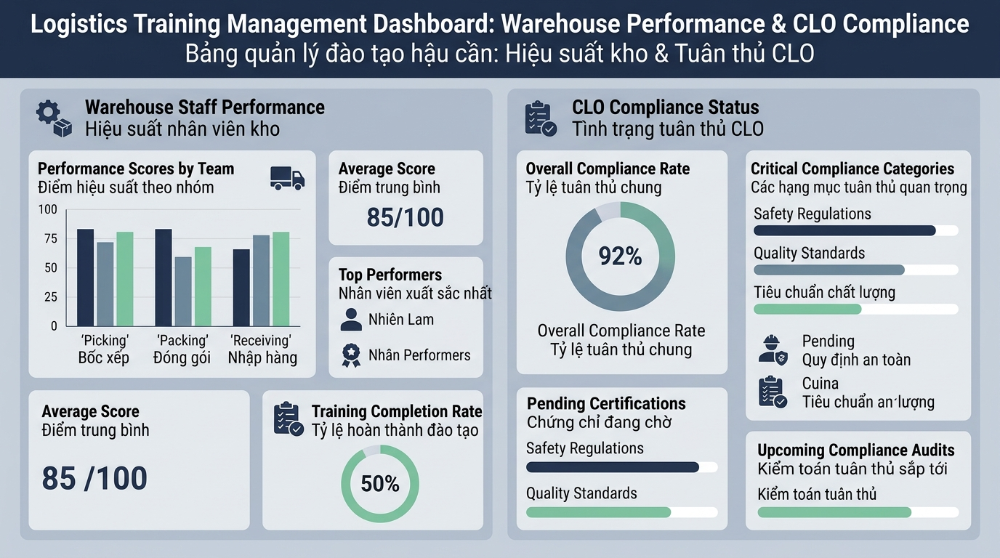

## <center>[Vận dụng cơ bản 2] Sửa lỗi mô-đun đánh giá chuẩn đầu ra đào tạo kho vận Logistics</center>

### **1. Mục tiêu**
*   Phân tích và phát hiện các bẫy logic nghiệp vụ trong mô-đun đánh giá năng lực nhân sự kho vận (Logistics Training Evaluation Engine).
*   Xây dựng bảng ma trận kiểm thử (Diagnostic Test Report) gồm tối thiểu 03 kịch bản chi tiết để chứng minh sai lệch của hệ thống legacy.
*   Tối ưu hóa và tái cấu trúc mã nguồn JavaScript theo chuẩn cấu trúc dữ liệu minh bạch, tuân thủ đúng quy chuẩn trọng số (20% Chuyên cần - 30% Đánh giá giữa kỳ - 50% Thực hành cuối môn) và điều kiện chuyên cần tối thiểu (>= 80% số buổi).

### **2. Bối cảnh & Vấn đề**
Doanh nghiệp Logistics **SmartLog Supply Chain** đang triển khai chương trình đào tạo chuẩn hóa cho đội ngũ điều phối kho vận (mã môn `LOG-105`: Quản trị Đơn hàng & Kho vận Doanh nghiệp). Để đảm bảo chất lượng đầu ra (CLO/PLO), trung tâm kỹ thuật cần một hệ thống phần mềm tự động tính toán điểm số tổng kết và xét duyệt điều kiện đạt chuẩn của từng nhân viên.

Tuy nhiên, mô-đun đánh giá hiện tại do lập trình viên thử việc bàn giao đang gặp phải các lỗi nghiệp vụ nghiêm trọng:
1. Tính điểm trung bình cộng cào bằng (chia đều 33.3% cho 3 cột điểm) thay vì áp dụng đúng tỷ trọng chuẩn doanh nghiệp (20% Chuyên cần, 30% Đánh giá giữa kỳ, 50% Thực hành cuối môn).
2. Hoàn toàn bỏ qua điều kiện kiểm tra tỷ lệ tham gia lớp học (yêu cầu tham gia tối thiểu 80% tổng số buổi học), dẫn đến trường hợp nhân viên nghỉ học vượt quá quy định vẫn được ghi nhận "ĐẠT CHUẨN ĐẦU RA".
3. Điểm tổng kết không được xử lý làm tròn chuẩn 2 chữ số thập phân, gây sai lệch khi tích hợp vào cơ sở dữ liệu báo cáo quản trị kho.


<p align="center">
  
</p>


### **3. Mã nguồn hiện tại**
Dưới đây là đoạn mã JavaScript đang vận hành bị lỗi logic nghiệp vụ tại hệ thống SmartLog Supply Chain:

```javascript
// BAD: Mã nguồn lỗi nghiệp vụ tính điểm đào tạo nhân sự kho vận
class LegacyLogisticsEvaluation {
  constructor(courseCode, totalSessions) {
    this.courseCode = courseCode;
    this.totalSessions = totalSessions;
  }

  // BAD: Tính trung bình cộng cào bằng, không áp dụng trọng số 20% - 30% - 50%
  calculateScore(score1, score2, score3) {
    let average = (score1 + score2 + score3) / 3;
    return average;
  }

  // BAD: Bỏ qua kiểm tra chuyên cần 80% và xét duyệt điểm chuẩn không chính xác
  checkPass(finalScore, attendedCount) {
    if (finalScore >= 5.0) {
      return "ĐẠT CHUẨN ĐẦU RA (CLO/PLO)";
    } else {
      return "KHÔNG ĐẠT CHUẨN ĐẦU RA";
    }
  }
}

// Chạy mô phỏng kiểm thử thực tế với nhân viên kho
const evaluator = new LegacyLogisticsEvaluation("LOG-105", 10);
const score = evaluator.calculateScore(10.0, 4.0, 4.0); // Chuyên cần 10, Giữa kỳ 4, Cuối kỳ 4
const status = evaluator.checkPass(score, 5); // Nghỉ 5/10 buổi (chỉ tham gia 50%)

console.log("Mã môn học: " + evaluator.courseCode);
console.log("Điểm tổng kết: " + score);
console.log("Trạng thái: " + status);
```

### **4. Yêu cầu bài toán**

Học viên thực hiện các nhiệm vụ sau để hoàn thiện mô-đun:

**Phần 1: Lập Báo cáo Phân tích & Kiểm thử (Diagnostic Test Report)**
*   Xây dựng bảng kiểm thử tối thiểu 03 kịch bản (Test Cases) chứng minh các sai lệch logic của mã nguồn cũ. Bảng kiểm thử phải được trình bày theo cấu trúc HTML Table chuẩn như sau:

<table style="width: 100%; min-width: 100%; display: table; border-collapse: collapse;" width="100%" border="1">
  <thead>
    <tr style="background-color: #f2f2f2;">
      <th style="padding: 8px; text-align: left;">Mã Test Case</th>
      <th style="padding: 8px; text-align: left;">Dữ liệu đầu vào (Input)</th>
      <th style="padding: 8px; text-align: left;">Kết quả lỗi thực tế (Buggy Output)</th>
      <th style="padding: 8px; text-align: left;">Kết quả kỳ vọng đúng (Expected Output)</th>
    </tr>
  </thead>
  <tbody>
    <tr>
      <td style="padding: 8px;">TC-01</td>
      <td style="padding: 8px;">Điểm (10, 4.0, 4.0), Số buổi: 5/10</td>
      <td style="padding: 8px;">Điểm: 6.0, Trạng thái: ĐẠT CHUẨN ĐẦU RA</td>
      <td style="padding: 8px;">Điểm: 5.20, Trạng thái: KHÔNG ĐẠT CHUẨN ĐẦU RA (Do tham gia 5/10 &lt; 8 buổi)</td>
    </tr>
    <tr>
      <td style="padding: 8px;">TC-02</td>
      <td style="padding: 8px;">...</td>
      <td style="padding: 8px;">...</td>
      <td style="padding: 8px;">...</td>
    </tr>
    <tr>
      <td style="padding: 8px;">TC-03</td>
      <td style="padding: 8px;">...</td>
      <td style="padding: 8px;">...</td>
      <td style="padding: 8px;">...</td>
    </tr>
  </tbody>
</table>

**Phần 2: Tái cấu trúc & Khắc phục lỗi mã nguồn (Code Refactoring)**
*   Viết lại lớp `CourseEvaluationEngine` bằng JavaScript chuẩn enterprise.
*   Khai báo đối tượng `weights` cố định tỷ trọng trong `constructor`: `attendance: 0.20`, `midtermExam: 0.30`, `finalPracticalExam: 0.50`.
*   Xây dựng phương thức `calculateFinalScore(attendanceScore, midtermScore, finalPracticalScore)` tính điểm tổng kết chính xác theo trọng số và làm tròn 2 chữ số thập phân (`toFixed(2)` và ép kiểu `Number`).
*   Xây dựng phương thức `verifyCLOCompletion(finalScore, attendedSessions)` kiểm tra đồng thời 2 điều kiện:
    1.  `attendedSessions >= totalSessions * 0.8` (Số buổi tham gia tối thiểu 80%).
    2.  `finalScore >= 5.0` (Điểm tổng kết tối thiểu 5.0).
*   Phương thức trả về đối tượng thông tin gồm: `courseCode`, `finalScore`, `attendedSessions`, `isPassed` (boolean), và `statusMessage` ("ĐẠT CHUẨN ĐẦU RA (CLO/PLO)" hoặc "KHÔNG ĐẠT CHUẨN ĐẦU RA").

### **5. Yêu cầu nộp bài**
Học viên cần nộp:
*   Phần phân tích/báo cáo và mã nguồn triển khai.
*   Đẩy mã nguồn lên GitHub theo định dạng thư mục: `[Tên Lớp]_[Môn Học]_Session01_Ex02`.
    Ví dụ: `HNKS25CNTT1_Tooling_Session01_Ex02`