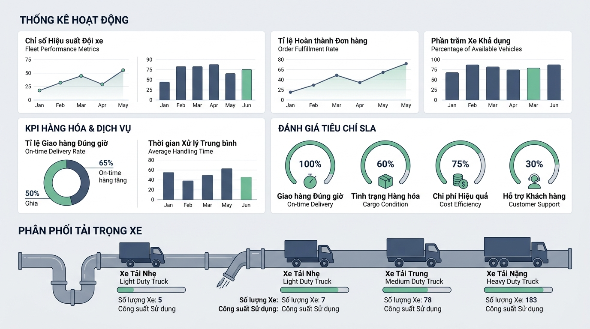

## 
[Vận dụng chuyên sâu] Thiết kế hệ thống đánh giá chỉ số vận hành và phân bổ tải trọng Logistics

### **1. Mục tiêu**
*   **Tư duy kiến trúc hệ thống:** Áp dụng tư duy thiết kế hướng đối tượng và cấu trúc dữ liệu minh bạch trong JavaScript để giải quyết bài toán quản lý chỉ số chất lượng dịch vụ vận chuyển.
*   **Xử lý logic đa tiêu chí:** Triển khai thuật toán tính toán phân bổ tải trọng container/phương tiện kho bãi theo từng cấp độ quy mô dựa trên ngưỡng quy đổi.
*   **Đánh giá điều kiện ràng buộc SLA:** Phân tích và xây dựng logic kiểm tra điều kiện đạt chuẩn cam kết dịch vụ SLA (Service Level Agreement) cho các chuyến hàng logistics dựa trên ma trận trọng số và tỷ lệ chặng vận chuyển thành công.

### **2. Bối cảnh & Vấn đề**
Công ty Logistics SmartFreight đang triển khai module đánh giá hiệu suất vận tải tự động cho trung tâm điều hành kho bãi. Hệ thống quản lý hiện tại gặp khó khăn khi đánh giá chất lượng dịch vụ của các đơn vị đối tác: điểm số đánh giá bị tính trung bình cộng cào bằng thay vì nhân theo trọng số chuyên biệt, đồng thời việc phân bổ số lượng kiện hàng tối đa trên từng loại xe container bị sai lệch so với tải trọng thực tế.

Nhằm giải quyết triệt để vấn đề này, ban kỹ thuật yêu cầu xây dựng một module trung tâm bằng JavaScript đáp ứng các yêu cầu nghiệp vụ:
1. Đánh giá chất lượng chuyến hàng dựa trên 3 tiêu chí trọng số: Tỷ lệ giao hàng đúng giờ (20%), Độ an toàn hàng hóa (30%), và Trải nghiệm phản hồi từ khách hàng (50%).
2. Kiểm tra chuyến hàng có đạt chuẩn cam kết chất lượng SLA hay không (Yêu cầu điểm số tổng kết từ 5.0 trở lên và tỷ lệ hoàn thành các chặng kiểm soát đạt từ 80% trở lên).
3. Phân bổ quy mô tải trọng hạ tầng kho và phương tiện vận chuyển (Container / Xe tải) dựa trên tổng trọng lượng thực tế của lô hàng.

  

### **3. Quy tắc nghiệp vụ**
Hệ thống đánh giá vận tải phải tuân thủ nghiêm ngặt các quy tắc định lượng sau:

**Quy tắc 1: Công thức tính điểm tổng kết vận chuyển (Overall Logistics Score)**
*   Điểm Đúng giờ (`onTimeScore`): Trọng số **20%** (0.20).
*   Điểm An toàn hàng hóa (`safetyScore`): Trọng số **30%** (0.30).
*   Điểm Phản hồi khách hàng (`deliveryScore`): Trọng số **50%** (0.50).
*   Công thức: `totalScore = (onTimeScore * 0.20) + (safetyScore * 0.30) + (deliveryScore * 0.50)`.
*   Kết quả `totalScore` phải được làm tròn đến 2 chữ số thập phân (`toFixed(2)`).

**Quy tắc 2: Điều kiện nghiệm thu đạt chuẩn SLA (SLA Completion Verification)**
*   Xác định tổng số chặng đường kiểm soát bắt buộc (`totalMilestones`).
*   Tỷ lệ chặng đường hoàn thành tối thiểu: **80%** tổng số chặng (`totalMilestones * 0.8`).
*   Điều kiện ĐẠT SLA (`isSlaPassed`): `totalScore >= 5.0` VÀ `completedMilestones >= minMilestonesRequired`.
*   Thông điệp trạng thái trả về:
    *   Nếu đạt: `"ĐẠT CHUẨN VẬN HÀNH SLA"`
    *   Nếu không đạt: `"KHÔNG ĐẠT CHUẨN VẬN HÀNH SLA"`

**Quy tắc 3: Phân bổ quy mô tải trọng kho bãi (Payload Distribution Metrics)**
Dựa vào tổng trọng lượng lô hàng (`cargoWeight` tính bằng kg), hệ thống phân loại và xác định thông số đóng gói:
*   Ngưỡng tải trọng (`WEIGHT_BREAKPOINTS`): `LIGHT` (dưới 1000 kg), `MEDIUM` (từ 1000 kg đến dưới 5000 kg), `HEAVY` (từ 5000 kg trở lên).
*   Quy định phân bổ:
    *   Cấp độ `LIGHT`: Số kiện hàng tối đa/lượt = 20, Số làn xếp hàng (Layout Columns) = 2.
    *   Cấp độ `MEDIUM`: Số kiện hàng tối đa/lượt = 50, Số làn xếp hàng (Layout Columns) = 4.
    *   Cấp độ `HEAVY`: Số kiện hàng tối đa/lượt = 100, Số làn xếp hàng (Layout Columns) = 8.

**Bảng cấu trúc dữ liệu mô phỏng nghiệp vụ:**
<table style="width: 100%; min-width: 100%; display: table; border-collapse: collapse;" width="100%" border="1" cellpadding="8">
  <thead>
    <tr style="background-color: #f2f2f2;">
      <th style="border: 1px solid #dddddd; text-align: left;">Tên trường / Dữ liệu</th>
      <th style="border: 1px solid #dddddd; text-align: left;">Kiểu dữ liệu</th>
      <th style="border: 1px solid #dddddd; text-align: left;">Mô tả / Ví dụ dữ liệu mẫu</th>
    </tr>
  </thead>
  <tbody>
    <tr>
      <td style="border: 1px solid #dddddd;"><code>shipmentCode</code></td>
      <td style="border: 1px solid #dddddd;">String</td>
      <td style="border: 1px solid #dddddd;">Mã định danh chuyến hàng (Ví dụ: <code>"SHIP-8899"</code>)</td>
    </tr>
    <tr>
      <td style="border: 1px solid #dddddd;"><code>totalMilestones</code></td>
      <td style="border: 1px solid #dddddd;">Number</td>
      <td style="border: 1px solid #dddddd;">Tổng số chặng đường bắt buộc (Ví dụ: <code>10</code>)</td>
    </tr>
    <tr>
      <td style="border: 1px solid #dddddd;"><code>completedMilestones</code></td>
      <td style="border: 1px solid #dddddd;">Number</td>
      <td style="border: 1px solid #dddddd;">Số chặng đã hoàn thành đúng chuẩn (Ví dụ: <code>9</code>)</td>
    </tr>
    <tr>
      <td style="border: 1px solid #dddddd;"><code>scoresPayload</code></td>
      <td style="border: 1px solid #dddddd;">Object</td>
      <td style="border: 1px solid #dddddd;"><code>{ onTimeScore: 8.5, safetyScore: 9.0, deliveryScore: 7.5 }</code></td>
    </tr>
    <tr>
      <td style="border: 1px solid #dddddd;"><code>cargoWeight</code></td>
      <td style="border: 1px solid #dddddd;">Number</td>
      <td style="border: 1px solid #dddddd;">Tổng trọng lượng kiện hàng (Ví dụ: <code>3500</code> kg)</td>
    </tr>
  </tbody>
</table>

### **4. Yêu cầu bài toán**
[REQUIREMENT] Học viên KHÔNG được chép mã nguồn mẫu có sẵn. Cần tự thiết kế cấu trúc dữ liệu và viết mã nguồn từ đầu dựa trên logic bài toán.

*   **Phần 1: Báo cáo Phân tích & Thiết kế Giải pháp**
    *   Xác định chi tiết kiểu dữ liệu đầu vào (Input) và đối tượng trả về (Output) cho từng module nghiệp vụ.
    *   Mô tả giải thuật tính điểm trọng số, kiểm tra SLA và tính toán phân bổ tải trọng bằng Mã giả (Pseudocode) hoặc Sơ đồ khối (Flowchart).

*   **Phần 2: Triển khai Mã nguồn (JavaScript)**
    *   Định nghĩa lớp `LogisticsEvaluationEngine` có các phương thức khởi tạo mã chuyến hàng, tổng số chặng, và tính điểm tổng kết kèm kiểm tra điều kiện SLA.
    *   Viết hàm `calculatePayloadLayout(cargoWeight)` để tự động trả về cấp độ tải trọng, số kiện hàng tối đa và số làn xếp hàng tương ứng.
    *   Thực hiện kiểm soát bẫy biên: Phát hiện dữ liệu không hợp lệ khi điểm số nằm ngoài khoảng `[0, 10]` hoặc số chặng đã hoàn thành vượt quá tổng số chặng (`completedMilestones > totalMilestones`).
    *   Xây dựng kịch bản chạy thử nghiệm (Test Script) minh họa cho 2 trường hợp: 1 chuyến hàng ĐẠT chuẩn SLA và 1 chuyến hàng KHÔNG ĐẠT chuẩn SLA.

### **5. Yêu cầu nộp bài**
Học viên cần nộp:
*   Phần phân tích/báo cáo và mã nguồn triển khai.
*   Đẩy mã nguồn lên GitHub theo định dạng thư mục: `[Tên Lớp]_[Môn Học]_Session01_Ex03`.
    Ví dụ: `HNKS25CNTT1_Tooling_Session01_Ex03`