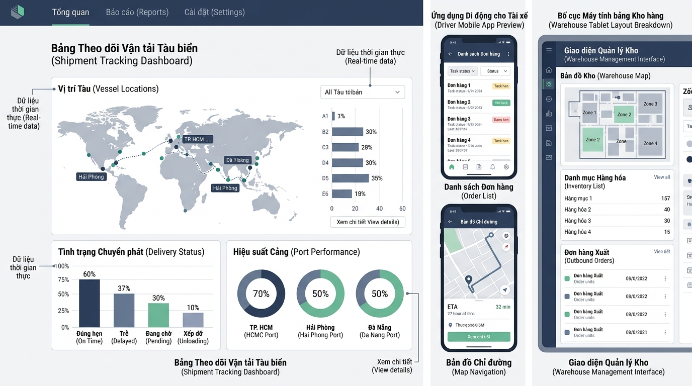

## 
[Sáng tạo] Thiết kế hệ thống đánh giá chỉ số vận hành và hiển thị Responsive cho trung tâm Logistics

### **1. Mục tiêu**
*   Vận dụng tư duy thiết kế hệ thống đánh giá chỉ số hiệu năng (tương tự mô hình tính điểm đánh giá chuẩn đầu ra) để quản lý tiêu chuẩn chất lượng vận tải trong lĩnh vực kho vận (Logistics).
*   Tự thiết kế cơ chế tính toán cấu hình hiển thị giao diện bảng điều khiển (Dashboard Metrics Layout) linh hoạt dựa trên chiều rộng màn hình thiết bị điều hành (Mobile, Tablet, Desktop).
*   Phát triển prompt chuẩn RCTC hỗ trợ bộ phận điều phối kho vận tự động hóa việc tóm tắt sự cố và tạo báo cáo vận hành.
*   Thể hiện năng lực phân tích kỹ thuật độc lập: tự định nghĩa Schema dữ liệu đầu vào/đầu ra, tự phát hiện bẫy lỗi biên (edge cases), vẽ sơ đồ luồng dữ liệu (Mermaid Diagram) và triển khai mã nguồn hoàn chỉnh từ đầu.

### **2. Bối cảnh & Vấn đề**
Doanh nghiệp vận chuyển quốc tế SmartLogistics đang xây dựng phân hệ giám sát chất lượng dịch vụ vận đơn hàng ngày. Hệ thống điều hành yêu cầu tính toán điểm tuân thủ thỏa thuận mức dịch vụ (SLA Compliance Score) cho từng đối tác vận tải dựa trên nhiều chỉ số như: tỉ lệ giao hàng đúng giờ, tỉ lệ bảo toàn hàng hóa không hư hại, và tỉ lệ hoàn thành thủ tục kiểm kê kho.

Đồng thời, bảng điều khiển của hệ thống cần phục vụ nhiều đối tượng nhân sự với các thiết bị khác nhau: tài xế lái xe tải (màn hình di động), giám sát viên tại bãi xe (màn hình máy tính bảng), và quản lý điều phối trung tâm (màn hình máy tính để bàn). Cấu hình hiển thị số lượng thẻ thông tin vận đơn và số cột giao diện phải tự động điều chỉnh theo kích thước màn hình hiển thị. Ngoài ra, bộ phận vận hành cần một cấu trúc Prompt chuẩn RCTC để hỗ trợ các chuyên viên trích xuất báo cáo tổng hợp các vụ việc tắc nghẽn kho bãi hàng tuần.

  

### **3. Quy tắc nghiệp vụ**
*   **Cơ chế đánh giá hiệu năng vận tải (Logistics Evaluation Engine):**
    *   Quản lý danh mục trọng số đánh giá dịch vụ logistics với 3 tiêu chí chính: Tỉ lệ giao hàng đúng giờ (On-Time Delivery Weight), Tỉ lệ hàng hóa an toàn (Cargo Safety Weight), và Tỉ lệ tuân thủ quy trình kiểm kê (Audit Compliance Weight). Tổng các trọng số phải đúng bằng 1.0 (100%).
    *   Tính toán điểm SLA tổng hợp theo thang điểm 10.0. Điểm số kết quả được làm tròn chính xác 2 chữ số thập phân.
    *   Xác định trạng thái đạt chuẩn vận hành (SLA Passed) khi điểm tổng kết đạt từ ngưỡng tối thiểu (ví dụ: điểm >= 5.0/10.0) và tỉ lệ hoàn thành số chuyến đi tối thiểu đạt từ 80% trở lên.
*   **Cơ chế tính toán cấu hình hiển thị (Responsive Layout Engine):**
    *   Căn cứ vào kích thước chiều rộng màn hình (viewport width tính theo pixel), phân loại chính xác các nhóm thiết bị (như Mobile, Tablet, Desktop).
    *   Xác định tự động số lượng vận đơn tối đa hiển thị trên một trang (max items per page) và số cột sắp xếp giao diện (layout columns) tương ứng với từng nhóm thiết bị.
*   **Chuẩn hóa Prompt RCTC cho báo cáo vận hành:**
    *   Xây dựng một khung prompt mẫu tuân thủ đầy đủ 4 thành phần RCTC (Role, Context, Task, Constraint) giúp nhân viên điều phối tạo báo cáo tổng hợp sự cố kho vận ngắn gọn, chính xác.

### **4. Yêu cầu bài toán**
Học viên chủ động phân tích và hiện thực hóa bài toán từ đầu (không sử dụng mã nguồn gợi ý có sẵn), trình bày báo cáo bài làm theo 4 phần bắt buộc:

*   **Phần 1 - Tự thiết kế Schema I/O:** Tự định nghĩa cấu trúc dữ liệu đầu vào (Input Request/Parameters) và đầu ra (Output Response/Metrics) cho các chức năng tính điểm SLA vận đơn và tính toán cấu hình hiển thị responsive.
*   **Phần 2 - Tự phát hiện bẫy dữ liệu (Edge Cases):** Chủ động tìm và phân tích ít nhất 3 bẫy lỗi biên hoặc xung đột dữ liệu trong vận hành logistics (ví dụ: trọng số không bằng 1.0, điểm đầu vào nằm ngoài thang điểm, kích thước màn hình là số âm hoặc bằng 0, số chuyến tham gia bị rỗng) và đề xuất phương án xử lý chi tiết.
*   **Phần 3 - Sơ đồ luồng dữ liệu (Data Flow Diagram):** Trình bày sơ đồ Mermaid (`mermaid graph TD` hoặc `sequenceDiagram`) mô tả toàn bộ vòng đời xử lý dữ liệu từ lúc tiếp nhận thông số vận chuyển đến khi trả về báo cáo đánh giá và cấu hình hiển thị.
*   **Phần 4 - Hiện thực hóa mã nguồn sáng tạo:** Viết mã nguồn hoàn chỉnh (bằng JavaScript hoặc TypeScript) triển khai toàn bộ các quy tắc nghiệp vụ nêu trên. Mã nguồn phải có cấu trúc đối tượng/lớp minh bạch, xử lý lỗi biên triệt để, bao gồm hàm tính toán responsive layout và chuỗi văn bản chứa Prompt RCTC tiêu chuẩn.

### **5. Yêu cầu nộp bài**
Học viên cần nộp:
*   Phần phân tích/báo cáo và mã nguồn triển khai.
*   Đẩy mã nguồn lên GitHub theo định dạng thư mục: `[Tên Lớp]_[Môn Học]_Session01_Ex05`.
    Ví dụ: `HNKS25CNTT1_Tooling_Session01_Ex05`