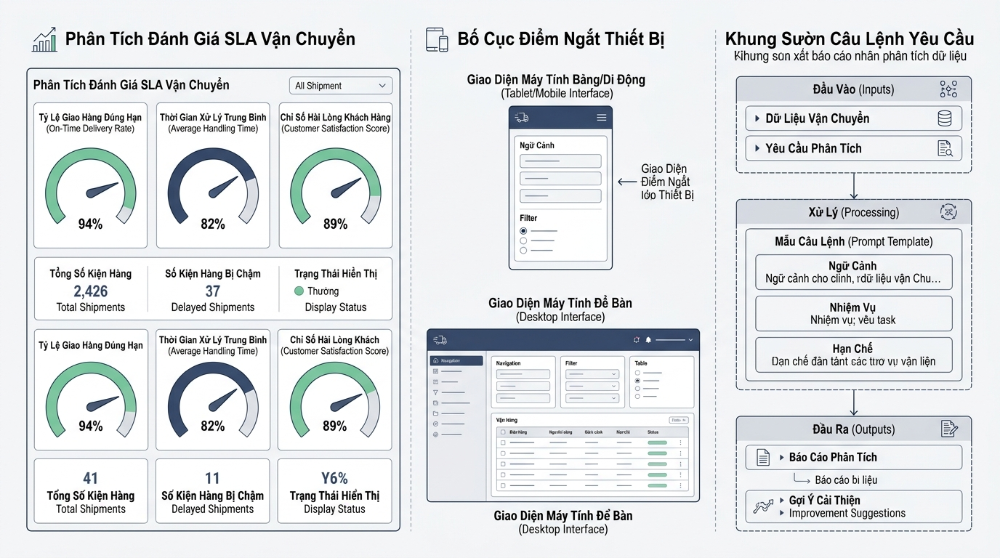

## 
[Bài tập tổng hợp] Xây dựng Hệ thống Đánh giá SLA và Cấu hình Dashboard Logistics

### **1. Mục tiêu**
*   **Tổng hợp tư duy hệ thống**: Vận dụng kiến thức thiết kế engine kiểm tra chỉ số theo trọng số và điều kiện ngưỡng chuẩn đầu ra (SLA Logistics).
*   **Tính toán cấu hình hiển thị**: Triển khai logic xác định thông số Responsive Dashboard cho ứng dụng quản lý vận tải theo từng loại thiết bị.
*   **Chuẩn hóa Prompt RCTC**: Xây dựngPrompt 4 thành phần (Role - Context - Task - Constraint) phục vụ việc chiết xuất báo cáo vận hành hàng hải và kho vận.
*   **Đóng gói sản phẩm**: Tổ chức mã nguồn JavaScript minh bạch, tuân thủ đúng quy chuẩn đặt tên biến tiếng Anh và chú thích tiếng Việt.

---

### **2. Bối cảnh & Vấn đề**
Doanh nghiệp vận tải toàn cầu **FastMove Logistics** đang nâng cấp cổng thông tin điều hành vận đơn. Hệ thống cần giải quyết 3 yêu cầu cấp thiết từ ban quản trị:
1.  **Đánh giá đối tác vận tải (SLA Engine)**: Tự động tính điểm hiệu xuất của các đội xe dựa trên 3 tiêu chí với trọng số khác nhau, đồng thời xét duyệt trạng thái Đạt/Không đạt SLA theo tỷ lệ chuyến xe hoàn tất.
2.  **Tối ưu giao diện giám sát (Responsive Dashboard)**: Tính toán tự động số lượng đơn hàng tối đa trên mỗi trang và số cột lưới hiển thị tùy thuộc vào kích thước màn hình quan sát của nhân viên điều độ.
3.  **Tự động hóa báo cáo bằng AI (Prompt RCTC)**: Cung cấp mẫu Prompt chuẩn hóa giúp nhân viên vận hành dùng AI tóm tắt các biên bản sự cố giao vận mà không vi phạm quy định định dạng.

  

---

### **3. Quy tắc nghiệp vụ**

#### **3.1 Quy tắc đánh giá đối tác vận tải (SLA Evaluation)**
*   Bảng trọng số đánh giá điểm SLA:
    *   Tỷ lệ giao hàng đúng giờ (`onTimeScore`): Trọng số **50%** (`0.50`).
    *   Tỷ lệ an toàn hàng hóa (`safetyScore`): Trọng số **30%** (`0.30`).
    *   Điểm đánh giá từ khách hàng (`feedbackScore`): Trọng số **20%** (`0.20`).
*   Công thức điểm tổng kết: `totalScore = (onTimeScore * 0.50) + (safetyScore * 0.30) + (feedbackScore * 0.20)`. Kết quả làm tròn 2 chữ số thập phân.
*   Điều kiện Đạt chuẩn SLA:
    *   Số chuyến xe hoàn tất (`completedTrips`) phải đạt tối thiểu **80%** tổng số chuyến được giao (`totalAssignedTrips`).
    *   Điểm tổng kết `finalScore` phải lớn hơn hoặc bằng **5.0/10.0**.

#### **3.2 Quy tắc phân bổ Layout Dashboard Logistics**
*   Màn hình Mobile (chiều rộng `< 768px`): Hỗ trợ tối đa **4 đơn hàng/trang**, hiển thị **1 cột**.
*   Màn hình Tablet (`768px <= chiều rộng < 1024px`): Hỗ trợ tối đa **8 đơn hàng/trang**, hiển thị **2 cột**.
*   Màn hình Desktop (chiều rộng `>= 1024px`): Hỗ trợ tối đa **12 đơn hàng/trang**, hiển thị **4 cột**.

#### **3.3 Quy tắc cấu trúc Prompt RCTC**
*   Phải đảm bảo đủ 4 thẻ thành phần: `[Role]`, `[Context]`, `[Task]`, `[Constraint]`.
*   Nội dung tập trung vào việc tóm tắt sự cố vận đơn logistics, yêu cầu độ dài dưới 150 từ và trình bày dạng gạch đầu dòng.

---

### **4. Yêu cầu bài toán**

Học viên tạo file `logistics_system.js` và thực hiện các yêu cầu sau:

1.  **Phần 1: Khởi tạo Class Engine và Logic Đánh giá SLA**
    *   Định nghĩa lớp `LogisticsEvaluationEngine` chứa `partnerCode` và `totalAssignedTrips`.
    *   Xây dựng phương thức `calculateSLAScore(onTimeScore, safetyScore, feedbackScore)` trả về điểm tổng kết làm tròn 2 chữ số thập phân.
    *   Xây dựng phương thức `verifySLACompliance(finalScore, completedTrips)` trả về đối tượng kết quả gồm: `partnerCode`, `finalScore`, `completedTrips`, `isSLACompliant` (boolean) và `statusMessage` ("ĐẠT CHUẨN SLA VẬN TẢI" hoặc "KHÔNG ĐẠT CHUẨN SLA VẬN TẢI").

2.  **Phần 2: Xây dựng hàm tính toán Responsive Layout Dashboard**
    *   Viết hàm `calculateLogisticsLayoutMetrics(viewportWidth)` trả về đối tượng gồm: `deviceCategory` ("MOBILE", "TABLET" hoặc "DESKTOP"), `maxOrdersPerPage`, `layoutColumns`.

3.  **Phần 3: Thiết lập Prompt RCTC mẫu**
    *   Tạo một hằng số chuỗi `LOGISTICS_PROMPT_TEMPLATE` chứa Prompt mẫu RCTC dùng cho trợ lý AI tổng hợp báo cáo vận đơn.

4.  **Phần 4: Thực thi và In kết quả**
    *   Khởi tạo engine cho đối tác `"PARTNER-EXPRESS-01"` với tổng `10` chuyến xe được giao.
    *   Thực hiện tính điểm với các chỉ số: `onTimeScore = 8.5`, `safetyScore = 9.0`, `feedbackScore = 7.0`.
    *   Kiểm tra điều kiện với số chuyến hoàn tất là `9` chuyến.
    *   Gọi hàm tính layout cho 2 trường hợp viewport: `375px` (Mobile) và `1280px` (Desktop).
    *   In toàn bộ kết quả kiểm tra và mẫu Prompt RCTC ra màn hình console theo định dạng sạch sẽ.

---

### **5. Yêu cầu nộp bài**

Học viên cần nộp:
*   File mã nguồn `logistics_system.js` chứa toàn bộ giải pháp.
*   Đẩy mã nguồn lên GitHub repository cá nhân theo đúng định dạng thư mục: `[Tên Lớp]_[Môn Học]_Session01_Ex06`.
    *   Ví dụ: `HNKS25CNTT1_Tooling_Session01_Ex06`