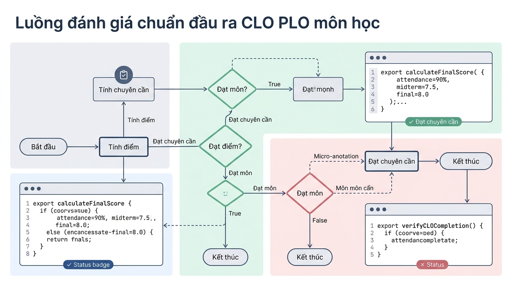

```markmap
# Định hướng khóa học & Lộ trình Git Version Control

## Mục tiêu bài học
- Nắm vững lộ trình đào tạo, thang điểm và chuẩn đầu ra CLO/PLO.
- Làm chủ kỹ thuật Prompt RCTC để tương tác hiệu quả với AI.
- Hiểu tư duy thiết kế giao diện Responsive và tiêu chuẩn dự án doanh nghiệp.
- Rèn luyện phương pháp chủ động tự học và quy trình làm việc nhóm.

## Đặt tình huống
- Sinh viên mơ hồ về lộ trình, không nắm rõ trọng số điểm các bài kiểm tra.
- Đặt câu hỏi AI thụ động, thiếu bối cảnh dẫn đến phản hồi sai lệch.
- Thiếu định hướng về sản phẩm thực tế và quy chuẩn thiết kế đa màn hình.

## Tổng quan nội dung & Lộ trình môn học
### Cấu trúc đánh giá
- Chuyên cần chiếm 20%, Bài giữa kỳ 30%, Thi thực hành 50%.
- Điểm trung bình môn đạt từ 5.0 trở lên mới đủ điều kiện qua môn.
- Tham gia tối thiểu 80% tổng số buổi học của toàn khóa.
### Cú pháp điều kiện Đạt
```javascript
const isPassed = finalScore >= 5.0 && attendedSessions >= (totalSessions * 0.8);
```
### Quy trình kiểm tra CLO

### Bẫy lỗi cần tránh
- Không tính trung bình cộng đơn thuần vì sai lệch trọng số đánh giá.
- Bài thi thực hành cuối môn quyết định 50% kết quả chung cuộc.

## Phương pháp học tập hiệu quả
### Kỹ thuật Prompt RCTC
- Role: Quy định rõ vai trò chuyên gia cho trợ lý AI.
- Context: Cung cấp bối cảnh thực tế và trình độ bản thân.
- Task: Mô tả chi tiết nhiệm vụ cụ thể cần AI giải quyết.
- Constraint: Thiết lập ràng buộc về định dạng, ngôn ngữ và độ dài.
### Mẫu Prompt chuẩn
```text
[Role]: TA lập trình. [Context]: Sinh viên mới học. [Task]: Tóm tắt 3 mục tiêu. [Constraint]: Tiếng Việt, gạch đầu dòng.
```
### Sai lầm phổ biến
- Đặt câu hỏi quá ngắn, thiếu bối cảnh và ràng buộc đầu ra.
- Học thụ động, chỉ đọc lý thuyết mà không tự gõ lại mã nguồn.

## Demo sản phẩm thực tế & Kỳ vọng đầu ra
### Tiêu chuẩn Responsive
- Mobile dưới 768px: Hiển thị 1 cột, tối đa 4 sản phẩm.
- Tablet 768px đến 1023px: Hiển thị 2 cột, tối đa 8 sản phẩm.
- Desktop từ 1024px trở lên: Hiển thị 4 cột, tối đa 12 sản phẩm.
### Cấu hình Breakpoints
```javascript
const maxProducts = isMobile ? 4 : (isTablet ? 8 : 12);
```
### Quy chuẩn doanh nghiệp
- Cấu trúc dữ liệu rõ ràng, mã nguồn sạch dễ bảo trì.
- Đáp ứng trải nghiệm người dùng mượt mà trên đa thiết bị.
```