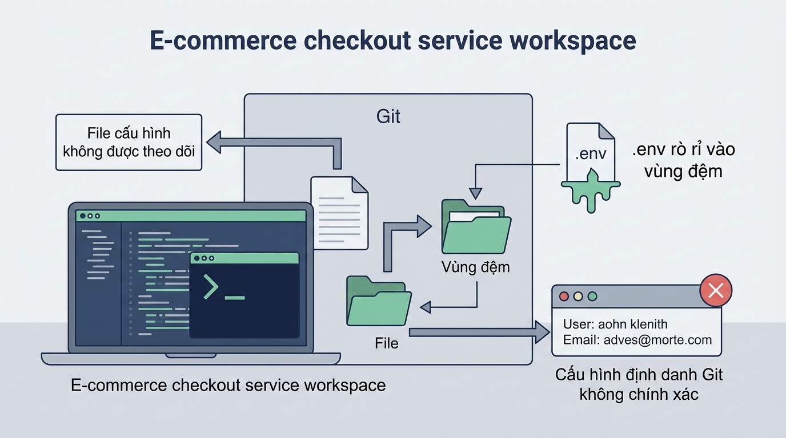

## <center>[Vận dụng cơ bản 1] Khắc phục sự cố cấu hình danh tính và quản lý loại trừ tệp trong kho chứa E-Commerce</center>

### **1. Mục tiêu**
*   **Cấu hình danh tính người dùng & môi trường Git CLI:** Thiết lập chính xác các thuộc tính toàn cục (`user.name`, `user.email`, `core.editor`, `core.autocrlf`) trên Git CLI 2.45+ tuân thủ tiêu chuẩn doanh nghiệp.
*   **Quản lý loại trừ tệp rác & bảo mật dữ liệu:** Xây dựng tệp cấu hình `.gitignore` cho dự án mô-đun thanh toán E-Commerce nhằm ngăn chặn việc vô tình đưa thông tin nhạy cảm (`.env`) và tệp bộ nhớ tạm (`node_modules/`, `dist/`, `*.log`) vào vùng dữ liệu.
*   **Hiểu rõ kiến trúc 3 vùng dữ liệu & Chuẩn Conventional Commits:** Nắm vững quy trình dịch chuyển tệp giữa Working Tree, Staging Area và Local Repository; thực thi các commit lịch sử chuẩn hóa (`feat`, `fix`, `docs`, `chore`).

### **2. Bối cảnh & Vấn đề**
Một lập trình viên mới gia nhập đội ngũ phát triển dịch vụ Checkout & Thanh toán của sàn thương mại điện tử E-Commerce. Trong quá trình khởi tạo kho chứa dữ liệu cục bộ (Local Repository) cho dịch vụ `checkout-service`, lập trình viên này đã mắc phải một số sai sót vận hành hệ thống:

1. Executed lệnh cấu hình danh tính `git config` sai cú pháp: tên có chứa khoảng trắng nhưng không bọc trong dấu ngoặc kép, sử dụng địa chỉ email cá nhân thay vì email doanh nghiệp (`dinh.nguyen@shopmall.com`), và cài đặt VS Code làm editor nhưng thiếu tham số quan trọng `--wait`.
2. Tạo tệp loại trừ `.gitignore` sai quy tắc cú pháp (`env` thay vì `.env`), khiến các tệp môi trường chứa mật khẩu kết nối cơ sở dữ liệu thanh toán (`.env.production.local`) và thư mục phụ thuộc nặng (`node_modules/`) bị đưa trực tiếp vào vùng chờ Staging Area.
3. Ghi nhận các commit bằng thông điệp tự do, không tuân thủ quy chuẩn Conventional Commits, gây mất khả năng truy vết lịch sử hệ thống.


<p align="center">
  
</p>


### **3. Mã nguồn hiện tại**

Lập trình viên tập sự đã thực thi chuỗi câu lệnh CLI và thiết lập cấu hình hệ thống như sau:

```bash
# 1. Cấu hình danh tính hệ thống bị lỗi
git config --global user.name Nguyen Van Dev
git config --global user.email dev_canhan_9x@gmail.com
git config --global core.editor code

# 2. Nội dung tệp .gitignore bị lỗi tại thư mục gốc của dự án checkout-service
# Tệp: .gitignore
env
build.js

# 3. Chuỗi lệnh làm việc bị lỗi trong vùng chờ
git add .
git commit -m "update code checkout and database config"
```

Cấu trúc thư mục làm việc thực tế của dự án `checkout-service`:
```text
checkout-service/
├── .env
├── .env.production.local
├── .gitignore
├── index.js
├── package.json
├── payment.log
├── node_modules/
└── dist/
```

### **4. Yêu cầu bài toán**

Học viên đóng vai trò Chuyên viên Quản trị Cấu hình (Configuration Management Specialist) thực hiện 2 phần việc:

#### **Phần 1: Lập báo cáo chẩn đoán sự cố vận hành (Diagnostic Report)**
Lập bảng phân tích tối thiểu 3 trường hợp thử nghiệm (Test Cases) chỉ rõ các thao tác lỗi, hậu quả thực tế đối với hệ thống và trạng thái chuẩn kỳ vọng sau khắc phục. Sử dụng đúng định dạng bảng HTML sau:

<table style="width: 100%; min-width: 100%; display: table; border-collapse: collapse;" width="100%" border="1">
  <thead>
    <tr style="background-color: #f1f5f9;">
      <th style="padding: 8px; text-align: left;">STT</th>
      <th style="padding: 8px; text-align: left;">Thao tác CLI / Cấu hình lỗi</th>
      <th style="padding: 8px; text-align: left;">Hậu quả thực tế trên hệ thống</th>
      <th style="padding: 8px; text-align: left;">Trạng thái chuẩn kỳ vọng sau khắc phục</th>
    </tr>
  </thead>
  <tbody>
    <tr>
      <td style="padding: 8px;">1</td>
      <td style="padding: 8px;"><code>git config --global user.name Nguyen Van Dev</code></td>
      <td style="padding: 8px;">Lỗi cú pháp do chứa khoảng trắng không ngoặc kép; Git nhận sai giá trị key/value.</td>
      <td style="padding: 8px;">Cấu hình đúng: <code>git config --global user.name "Nguyen Van Dev"</code></td>
    </tr>
    <tr>
      <td style="padding: 8px;">2</td>
      <td style="padding: 8px;">...</td>
      <td style="padding: 8px;">...</td>
      <td style="padding: 8px;">...</td>
    </tr>
    <tr>
      <td style="padding: 8px;">3</td>
      <td style="padding: 8px;">...</td>
      <td style="padding: 8px;">...</td>
      <td style="padding: 8px;">...</td>
    </tr>
  </tbody>
</table>

#### **Phần 2: Thực thi khắc phục sự cố bằng lệnh Git CLI**
1. Thực hiện thiết lập lại danh tính toàn cục (Global Scope) chuẩn mực cho hệ thống E-Commerce:
   *   Tên người dùng: `"Nguyen Van Dev"`
   *   Email doanh nghiệp: `"dinh.nguyen@shopmall.com"`
   *   Trình soạn thảo: `"code --wait"`
   *   Cấu hình xử lý xuống dòng tự động cho Windows: `true` (dùng `core.autocrlf`).
2. Viết lại nội dung tệp `.gitignore` chuẩn cho dự án Web Framework (Node.js/Express) thuộc mô-đun Checkout, đảm bảo chặn chính xác:
   *   Thư mục phụ thuộc: `node_modules/`
   *   Thư mục đóng gói: `dist/`
   *   Các tệp môi trường nhạy cảm: `.env`, `.env.local`, `.env.production.local` (hoặc mẫu `.env.*.local`)
   *   Các tệp nhật ký hệ thống: `*.log`
3. Kiểm tra trạng thái vùng làm việc bằng lệnh `git status`.
4. Đưa các tệp hợp lệ vào Staging Area và thực hiện ghi nhận phiên bản commit chuẩn theo chuẩn Conventional Commits:
   *   Ví dụ cú pháp commit chuẩn: `chore(config): thiet lap cau hinh loai tru tep va danh tinh he thong`

### **5. Yêu cầu nộp bài**
Học viên cần nộp:
*   Phần phân tích/báo cáo và mã nguồn triển khai.
*   Đẩy mã nguồn lên GitHub theo định dạng thư mục: `[Tên Lớp]_[Môn Học]_Session02_Ex01`.
    Ví dụ: `HNKS25CNTT1_Tooling_Session02_Ex01`