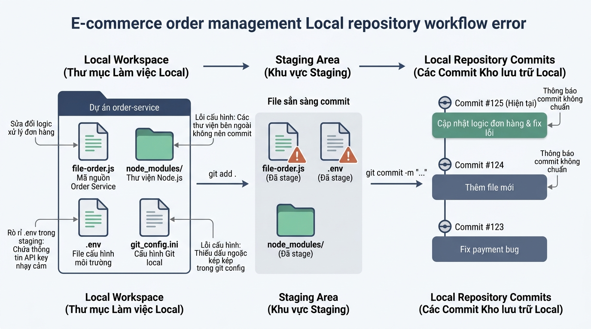

## <center>[Vận dụng cơ bản 2] Khắc Phục Sự Cố Cấu Hình Kho Chứa Hàng E-Commerce Và Quy Chuẩn Ghi Nhận Phiên Bản</center>

### **1. Mục tiêu**
*   **Phân tích sự cố vận hành Git CLI**: Nhận diện và đánh giá được các lỗi cấu hình danh tính người dùng toàn cục (`git config`), cấu hình tệp loại trừ nhạy cảm (`.gitignore`), và vi phạm quy trình quản lý 3 vùng dữ liệu trong kho chứa dịch vụ xử lý đơn hàng E-Commerce.
*   **Khắc phục và chuẩn hóa cấu hình môi trường**: Thực thi chính xác các câu lệnh Git CLI 2.45+ để thiết lập thông tin người dùng doanh nghiệp, tích hợp trình soạn thảo chuẩn và xử lý đúng ký tự xuống dòng `core.autocrlf`.
*   **Quản lý Staging Area và loại trừ tệp nhạy cảm**: Xây dựng tệp `.gitignore` chuẩn hóa cho dịch vụ Web Framework E-Commerce, ngăn chặn tuyệt đối việc đưa tệp bí mật môi trường (`.env`) và các tệp phụ thuộc nặng (`node_modules/`) vào lịch sử quản lý phiên bản.
*   **Thực hành quy chuẩn Conventional Commits**: Đưa mã nguồn vào vùng chờ và thực hiện ghi nhận phiên bản theo chuẩn Conventional Commits (`feat`, `fix`, `docs`), kiểm tra lịch sử với `git log --oneline`.

---

### **2. Vấn đề**
Doanh nghiệp E-Commerce đang triển khai dự án dịch vụ thanh toán và quản lý đơn hàng `ecommerce-order-service`. Lập trình viên mới tiếp nhận dự án (Junior Developer) đã thực hiện khởi tạo kho chứa dữ liệu cục bộ và cấu hình môi trường phát triển. Tuy nhiên, qua kiểm tra an toàn hệ thống và quy trình sản xuất, đội ngũ Quản trị Kỹ thuật (DevOps Lead) phát hiện nhiều lỗi cấu hình nghiêm trọng:

1.  **Lỗi cấu hình danh tính**: Đã thiết lập `user.name` thiếu dấu ngoặc kép chứa khoảng trắng làm sai lệch cú pháp giá trị, sử dụng tài khoản email cá nhân không hợp lệ thay vì email doanh nghiệp, và khai báo `core.editor` thiếu tham số bắt buộc `--wait`.
2.  **Rò rỉ dữ liệu nhạy cảm và phình dung lượng kho chứa**: Tệp loại trừ `.gitignore` bị viết sai quy chuẩn, dẫn đến việc tệp cấu hình chứa khoá mật khẩu thanh toán `.env`, thư mục phụ thuộc `node_modules/` và các tệp nhật ký hệ thống `*.log` bị đưa thẳng vào vùng chờ Staging Area thông qua câu lệnh `git add`.
3.  **Vi phạm quy chuẩn nhật ký lịch sử**: Các phiên bản lưu vết được ghi nhận với thông điệp tùy tiện ("update code", "fix loi"), vi phạm nghiêm trọng quy chuẩn ghi nhận phiên bản chuẩn hóa (Conventional Commits).


<p align="center">
  
</p>


---

### **3. Mã nguồn hiện tại**

#### **A. Kịch bản các câu lệnh bị lỗi do lập trình viên thực thi trước đó (`setup_faulty.sh`)**
```bash
# 1. Cấu hình danh tính không đúng quy chuẩn (Thiếu ngoặc kép, email sai, thiếu --wait)
git config --global user.name Tran Van Dev
git config --global user.email dev_boy_9x@gmail.com
git config --global core.editor code

# 2. Khai báo tệp loại trừ .gitignore bị lỗi cú pháp
# (Tệp .gitignore hiện tại có nội dung sai)

# 3. Đưa toàn bộ thư mục dự án vào Staging Area
git add .

# 4. Ghi nhận commit không theo chuẩn Conventional Commits
git commit -m "cap nhat code va fix loi linh tinh"
```

#### **B. Nội dung tệp loại trừ bị lỗi hiện tại (`.gitignore`)**
```text
# BAD CONFIGURATION: Viết sai cú pháp và thiếu sót các tệp nhạy cảm
env
node_modules
build.js
```

#### **C. Trạng thái kiểm tra hệ thống thực tế (`git status` & `git config --list`)**
```text
$ git config --global --list
user.name=Tran
user.email=dev_boy_9x@gmail.com
core.editor=code

$ git status
On branch main
Changes to be committed:
  (use "git restore --staged <file>..." to unstage)
	new file:   .env
	new file:   node_modules/express/index.js
	new file:   package.json
	new file:   src/order/checkout.js
	new file:   system.log
```

---

### **4. Yêu cầu bài toán**

#### **Phần 1: Báo cáo phân tích sự cố (Diagnostic Report)**
Học viên cần phân tích kịch bản trên và lập bảng báo cáo kiểm thử sự cố vận hành (tối thiểu 3 test cases) theo mẫu sau:

<table style="width: 100%; min-width: 100%; display: table; border-collapse: collapse;" width="100%">
  <thead>
    <tr style="background-color: #0f172a; color: #ffffff;">
      <th style="border: 1px solid #cbd5e1; padding: 10px; text-align: left;">STT</th>
      <th style="border: 1px solid #cbd5e1; padding: 10px; text-align: left;">Thao tác / Cấu hình lỗi (Input Operation)</th>
      <th style="border: 1px solid #cbd5e1; padding: 10px; text-align: left;">Hành vi / Kết quả lỗi thực tế (Buggy Output)</th>
      <th style="border: 1px solid #cbd5e1; padding: 10px; text-align: left;">Kết quả kỳ vọng chuẩn sản xuất (Expected Output)</th>
    </tr>
  </thead>
  <tbody>
    <tr>
      <td style="border: 1px solid #cbd5e1; padding: 10px;">1</td>
      <td style="border: 1px solid #cbd5e1; padding: 10px;">Cấu hình user.name thiếu dấu ngoặc kép</td>
      <td style="border: 1px solid #cbd5e1; padding: 10px;">Git chỉ nhận từ đầu tiên "Tran", mất họ và tên lót</td>
      <td style="border: 1px solid #cbd5e1; padding: 10px;">Lưu trữ đầy đủ họ tên trong ngoặc kép: "Tran Van Dev"</td>
    </tr>
    <tr>
      <td style="border: 1px solid #cbd5e1; padding: 10px;">2</td>
      <td style="border: 1px solid #cbd5e1; padding: 10px;">...</td>
      <td style="border: 1px solid #cbd5e1; padding: 10px;">...</td>
      <td style="border: 1px solid #cbd5e1; padding: 10px;">...</td>
    </tr>
    <tr>
      <td style="border: 1px solid #cbd5e1; padding: 10px;">3</td>
      <td style="border: 1px solid #cbd5e1; padding: 10px;">...</td>
      <td style="border: 1px solid #cbd5e1; padding: 10px;">...</td>
      <td style="border: 1px solid #cbd5e1; padding: 10px;">...</td>
    </tr>
  </tbody>
</table>

#### **Phần 2: Thực thi lệnh Git CLI khắc phục sự cố**
Viết danh sách các câu lệnh Git CLI 2.45+ chính xác và chỉnh sửa tệp để hoàn thành các nhiệm vụ:
1.  **Cấu hình lại toàn bộ danh tính toàn cục**:
    *   `user.name`: `"Tran Van Dev"`
    *   `user.email`: `"dev.tran@company.com"` (Email doanh nghiệp)
    *   `core.editor`: `"code --wait"`
    *   `core.autocrlf`: `true` (Cho hệ điều hành Windows)
2.  **Cấu hình lại tệp `.gitignore` chuẩn sản xuất cho dự án Node.js E-Commerce**:
    *   Loại trừ thư mục phụ thuộc: `node_modules/`
    *   Loại trừ thư mục biên dịch: `dist/`, `build/`
    *   Loại trừ toàn bộ tệp bí mật môi trường: `.env`, `.env.*.local`
    *   Loại trừ tệp nhật ký: `*.log`
    *   Loại trừ bộ nhớ tạm hệ thống và trình soạn thảo: `.DS_Store`, `.vscode/`, `.idea/`
3.  **Xử lý làm sạch Staging Area & Ghi nhận phiên bản chuẩn**:
    *   Đưa tệp nhạy cảm `.env` và thư mục rác ra khỏi Staging Area (chỉ giữ lại mã nguồn nghiệp vụ `package.json`, `src/order/checkout.js` và `.gitignore`).
    *   Thực hiện tạo một commit mới tuân thủ chuẩn **Conventional Commits**:
        *   Cú pháp chuẩn: `feat(order): bổ sung module xử lý thanh toán đơn hàng e-commerce`
4.  **Truy vấn kiểm chuẩn trạng thái**:
    *   Chạy lệnh hiển thị danh sách cấu hình đã lưu toàn cục.
    *   Chạy lệnh kiểm tra nhật ký lịch sử commit dạng rút gọn một dòng (`git log --oneline`).

---

### **5. Yêu cầu nộp bài**
Học viên cần nộp:
*   Phần phân tích/báo cáo và mã nguồn triển khai.
*   Đẩy mã nguồn lên GitHub theo định dạng thư mục: `[Tên Lớp]_[Môn Học]_Session02_Ex02`.
    Ví dụ: `HNKS25CNTT1_Tooling_Session02_Ex02`