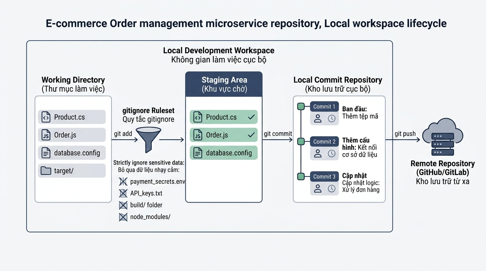

## 
[Vận dụng chuyên sâu 3] Thiết lập quy trình quản lý phiên bản chuẩn cho dịch vụ E-commerce Order Service

### **1. Mục tiêu**
*   **Hiểu và vận dụng kiến trúc 3 vùng dữ liệu:** Thao tác thành thạo sự chuyển dịch trạng thái của tập tin giữa Working Directory, Staging Area và Local Repository trên hệ thống Git CLI 2.45+.
*   **Thiết lập cấu hình danh tính chuẩn doanh nghiệp:** Thực hành thiết lập danh tính người dùng, trình soạn thảo mã nguồn VS Code và xử lý cơ chế xuống dòng `autocrlf` tự động phù hợp với môi trường dự án đa nền tảng.
*   **Xây dựng chiến lược loại trừ bảo mật và tối ưu dung lượng:** Viết tập tin `.gitignore` chuyên sâu cho dự án Web Framework E-commerce để chặn tuyệt đối các khóa bí mật thanh toán, tệp biên dịch trung gian, đồng thời thiết lập ngoại lệ lưu vết nhật ký kiểm toán.
*   **Chuẩn hóa lịch sử lưu trữ phiên bản:** Áp dụng chuẩn Conventional Commits (`feat`, `fix`, `docs`, `chore`) phục vụ công tác truy vấn lịch sử qua lệnh `git log --oneline`.

---

### **2. Bối cảnh & Vấn đề**
Sàn thương mại điện tử **EcoCart** đang triển khai hệ thống microservice quản lý đơn hàng mang tên `ecommerce-order-service`. Hệ thống này trực tiếp xử lý quy trình giỏ hàng, tính toán mã giảm giá và kết nối cổng thanh toán trực tuyến. 

Trong đợt kiểm toán an toàn thông tin gần nhất, bộ phận DevSecOps phát hiện các sự cố nghiêm trọng trên kho chứa mã nguồn cục bộ của đội ngũ phát triển:
1. **Lộ thông tin nhạy cảm:** Tệp cấu hình môi trường chứa khóa bí mật API cổng thanh toán VNPay và ZaloPay (`.env.production`) bị vô tình đưa vào Staging Area và lưu trữ vào lịch sử kho chứa.
2. **Phình to dung lượng kho chứa:** Thư mục mã phụ thuộc `node_modules/` và thư mục đóng gói `dist/` dung lượng lên tới 600MB bị theo dõi vết (tracked), khiến tốc độ sao lưu và truy vấn trạng thái kho chứa bị đình trệ.
3. **Thông điệp lưu trữ thiếu chuẩn hóa:** Đội ngũ phát triển ghi nhận commit với các nội dung ngắn cũn và mơ hồ như `"fix bug"`, `"update"`, `"code moi"`, khiến việc tìm kiếm điểm phát sinh lỗi trên môi trường sản xuất gặp rất nhiều khó khăn.

  

---

### **3. Quy tắc nghiệp vụ**

#### **Quy tắc 1: Cấu hình danh tính và môi trường phát triển (Environment & Identity Rules)**
*   Mọi thao tác ghi nhận phiên bản phải gắn liền với danh tính doanh nghiệp đã được định danh toàn cục (Global Scope):
    *   Tên lập trình viên: Đặt theo tên đầy đủ không dấu (ví dụ: `"Tran Van B"`).
    *   Email công việc: Đặt theo cấu trúc email doanh nghiệp `username@ecocart.vn`.
    *   Trình soạn thảo mặc định: Tích hợp Visual Studio Code kèm tham số chờ `--wait`.
    *   Cơ chế xuống dòng: Bật tính năng chuyển đổi ký tự xuống dòng tự động `core.autocrlf true`.

#### **Quy tắc 2: Ma trận loại trừ dữ liệu bảo mật và bộ nhớ rác (`.gitignore` Rules)**
Tập tin `.gitignore` phải tuân thủ đúng danh mục phân loại chi tiết sau:

<table style="width: 100%; min-width: 100%; display: table; border-collapse: collapse;" width="100%">
  <thead>
    <tr style="background-color: #0f172a; color: #ffffff;">
      <th style="border: 1px solid #334155; padding: 10px; text-align: left;">Phân loại dữ liệu</th>
      <th style="border: 1px solid #334155; padding: 10px; text-align: left;">Đường dẫn / Cú pháp mẫu</th>
      <th style="border: 1px solid #334155; padding: 10px; text-align: left;">Quy tắc loại trừ bắt buộc</th>
    </tr>
  </thead>
  <tbody>
    <tr>
      <td style="border: 1px solid #cbd5e1; padding: 10px;">Thư mục phụ thuộc & Biên dịch</td>
      <td style="border: 1px solid #cbd5e1; padding: 10px;"><code>node_modules/</code>, <code>dist/</code>, <code>build/</code></td>
      <td style="border: 1px solid #cbd5e1; padding: 10px;">Chặn toàn bộ thư mục và tài nguyên con bên trong.</td>
    </tr>
    <tr style="background-color: #f8fafc;">
      <td style="border: 1px solid #cbd5e1; padding: 10px;">Tệp bí mật môi trường</td>
      <td style="border: 1px solid #cbd5e1; padding: 10px;"><code>.env</code>, <code>.env.local</code>, <code>.env.production</code></td>
      <td style="border: 1px solid #cbd5e1; padding: 10px;">Chặn tuyệt đối bằng mẫu khớp mở rộng <code>.env*</code>.</td>
    </tr>
    <tr>
      <td style="border: 1px solid #cbd5e1; padding: 10px;">Tệp rác hệ điều hành & Editor</td>
      <td style="border: 1px solid #cbd5e1; padding: 10px;"><code>.DS_Store</code>, <code>Thumbs.db</code>, <code>.vscode/</code></td>
      <td style="border: 1px solid #cbd5e1; padding: 10px;">Bỏ qua tất cả tệp bộ nhớ tạm của OS và cấu hình IDE.</td>
    </tr>
    <tr style="background-color: #f8fafc;">
      <td style="border: 1px solid #cbd5e1; padding: 10px;">Nhật ký vận hành & Ngoại lệ</td>
      <td style="border: 1px solid #cbd5e1; padding: 10px;"><code>*.log</code>, <code>logs/audit-transactions.log</code></td>
      <td style="border: 1px solid #cbd5e1; padding: 10px;">Chặn toàn bộ tệp <code>*.log</code>, nhưng <strong>PHẢI GIỮ LẠI (Ngoại lệ)</strong> tệp <code>logs/audit-transactions.log</code> bằng cú pháp phủ định <code>!</code>.</td>
    </tr>
  </tbody>
</table>

#### **Quy tắc 3: Quy chuẩn ghi nhận thông điệp phiên bản (Conventional Commits Standard)**
Mọi thông điệp ghi nhận phiên bản (Commit Message) phải viết bằng tiếng Việt có dấu, định dạng theo chuẩn:
`<type>(<scope>): <mô tả ngắn gọn>`
*   `chore(config)`: Khởi tạo tệp cấu hình hệ thống hoặc thiết lập `.gitignore`.
*   `feat(order)`: Khởi tạo hoặc bổ sung tính năng nghiệp vụ xử lý đơn hàng/giỏ hàng.
*   `fix(checkout)`: Sửa lỗi liên quan đến tính toán khuyến mãi hoặc thanh toán đơn hàng.
*   `docs(api)`: Cập nhật tài liệu hướng dẫn tích hợp API.

---

### **4. Yêu cầu bài toán**

Bài tập bao gồm 2 phần bắt buộc học viên phải thực hiện:

#### **Phần 1: Phân tích và Thiết kế giải pháp (Báo cáo dạng văn bản/Markdown)**
1. **Định dạng Schema dữ liệu & Luồng thao tác I/O:** Liệt kê các lệnh Git CLI cần sử dụng, tham số đầu vào và kết quả đầu ra mong đợi trên terminal cho từng bước từ khởi tạo cấu hình đến ghi nhận lịch sử.
2. **Thiết kế biểu đồ/giả mã quản lý trạng thái tệp:** Vẽ sơ đồ hoặc trình bày chuỗi giả mã (Pseudocode) mô tả quá trình tệp đi qua 3 vùng dữ liệu (Working Directory -> Staging Area -> Repository Local), phân tích rõ điểm chặn của bộ lọc `.gitignore` khi thực hiện `git status` và `git add`.

#### **Phần 2: Thực hành triển khai kịch bản Git CLI**
Học viên mở Terminal và thực thi tuần tự các bước sau từ một thư mục trống:

1. **Cấu hình môi trường:**
   * Kiểm tra phiên bản Git CLI đang vận hành (yêu cầu phiên bản 2.45+).
   * Cấu hình thông tin `user.name`, `user.email`, `core.editor` và `core.autocrlf` phạm vi `--global` đúng Quy tắc nghiệp vụ 1. Truy vấn danh sách cấu hình để xác nhận.

2. **Khởi tạo và Xây dựng cấu trúc dự án `ecommerce-order-service`:**
   * Khởi tạo kho chứa Git cục bộ.
   * Tạo cấu trúc tệp mô phỏng thực tế gồm:
     * `src/order.js` (Mã nguồn xử lý đơn hàng)
     * `src/checkout.js` (Mã nguồn thanh toán)
     * `docs/api-v1.md` (Tài liệu API)
     * `node_modules/express/index.js` (Thư viện phụ thuộc)
     * `dist/bundle.js` (Tệp biên dịch)
     * `.env.production` (Khóa bí mật API)
     * `logs/system-error.log` (Nhật ký lỗi hệ thống)
     * `logs/audit-transactions.log` (Nhật ký kiểm toán giao dịch)

3. **Cấu hình và Kiểm chuẩn `.gitignore`:**
   * Tạo tệp `.gitignore` tại thư mục gốc dự án và khai báo các quy tắc theo Quy tắc nghiệp vụ 2.
   * Chạy lệnh `git status` và phân tích kết quả đầu ra. Xác nhận rằng `.env.production`, `node_modules/`, `dist/`, `logs/system-error.log` hoàn toàn KHÔNG xuất hiện trong danh sách *Untracked files*, trong khi `logs/audit-transactions.log` PHẢI xuất hiện.

4. **Thực thi quy trình Staging & Conventional Commits:**
   Thực hiện đưa dữ liệu vào vùng chờ và tạo 4 commit độc lập tuân thủ Quy tắc nghiệp vụ 3:
   * **Commit 1:** Đưa tệp `.gitignore` vào staging và ghi nhận với thông điệp:
     `chore(config): khởi tạo tập tin loại trừ dữ liệu bảo mật và tệp rác`
   * **Commit 2:** Đưa tệp `src/order.js` vào staging và ghi nhận với thông điệp:
     `feat(order): khởi tạo tính năng xử lý đơn hàng và giỏ hàng`
   * **Commit 3:** Đưa tệp `src/checkout.js` và `logs/audit-transactions.log` vào staging và ghi nhận với thông điệp:
     `fix(checkout): khắc phục lỗi tính sai mã giảm giá và bổ sung nhật ký kiểm toán`
   * **Commit 4:** Đưa tệp `docs/api-v1.md` vào staging và ghi nhận với thông điệp:
     `docs(api): cập nhật tài liệu chi tiết các REST API cho thanh toán`

5. **Xác minh lịch sử phiên bản:**
   * Thực hiện lệnh truy vấn nhật ký rút gọn một dòng `git log --oneline`. Kết quả xuất ra terminal phải thể hiện đủ 4 commit theo đúng thứ tự gian và đúng định dạng chuẩn.

---

### **5. Yêu cầu nộp bài**
Học viên cần nộp:
*   Phần phân tích/báo cáo và mã nguồn triển khai.
*   Đẩy mã nguồn lên GitHub theo định dạng thư mục: `[Tên Lớp]_[Môn Học]_Session02_Ex03`.
    Ví dụ: `HNKS25CNTT1_Tooling_Session02_Ex03`