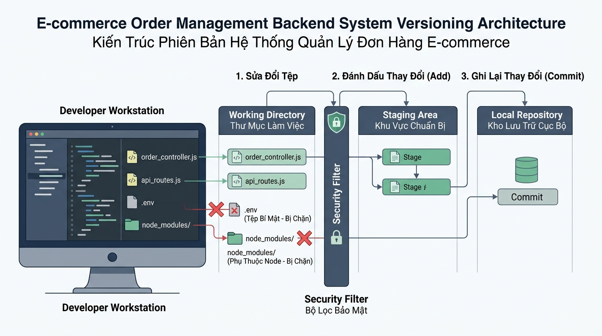

## 
[Phân tích] Thiết kế Quy trình Kiểm soát Phiên bản và Bảo mật Kho chứa Subsystem Đơn hàng E-Commerce

### **1. Mục tiêu**
*   **Đánh giá & So sánh Chiến lược:** Phân tích chuyên sâu ưu và nhược điểm giữa phương án đóng gói dữ liệu hàng loạt (Monolithic Staging) và đóng gói chi tiết theo tính năng (Granular Atomic Staging) áp dụng trong hệ thống thương mại điện tử.
*   **Vận dụng Kiến trúc 3 Vùng dữ liệu:** Hiểu rõ cơ chế tương tác giữa *Working Directory*, *Staging Area* và *Local Repository (Commit History)* bằng công cụ Git CLI 2.45+.
*   **Thiết lập Bộ lọc Bảo mật:** Xây dựng cấu hình `.gitignore` chuẩn hóa nhằm ngăn chặn việc rò rỉ dữ liệu nhạy cảm (API Key thanh toán, thông số kết nối cơ sở dữ liệu) và tối ưu hóa dung lượng lưu trữ kho chứa.
*   **Chuẩn hóa Lịch sử Commit:** Thực thi quy trình lưu vết lịch sử mã nguồn tuân thủ nghiêm ngặt chuẩn *Conventional Commits*.

---

### **2. Bối cảnh & Vấn đề**
Doanh nghiệp E-Commerce đang nâng cấp subsystem xử lý đơn hàng và thanh toán trực tuyến `ECom-Order-Service`. Đội ngũ kỹ sư tiến hành tái cấu trúc kho chứa cục bộ để chuẩn bị cho việc đóng gói các tính năng mới.

Hiện tại, thư mục làm việc (*Working Directory*) của hệ thống đang ghi nhận các tệp tin và thư mục sau:
1.  `src/controllers/orderController.js`: Mã nguồn xử lý tạo đơn hàng và tính toán mã giảm giá.
2.  `src/services/paymentService.js`: Mã nguồn tích hợp cổng thanh toán trực tuyến.
3.  `docs/order-api-spec.md`: Tài liệu kỹ thuật mô tả các RESTful API của hệ thống đơn hàng.
4.  `.env`: Tệp cấu hình chứa API Key cổng thanh toán và mật khẩu cơ sở dữ liệu môi trường phát triển.
5.  `.env.production.local`: Tệp cấu hình chứa Token chứng thực cao cấp của môi trường sản xuất.
6.  `node_modules/`: Thư mục chứa toàn bộ thư viện phụ thuộc của Node.js (dung lượng ~450MB).
7.  `dist/`: Thư mục chứa mã nguồn đã biên dịch (dung lượng ~35MB).
8.  `logs/payment-audit.log`: Tệp nhật ký giao dịch tài chính quan trọng cần bắt buộc giữ lại để kiểm toán.
9.  `logs/debug-runtime.log`: Tệp nhật ký lỗi tạm thời phát sinh trong quá trình chạy thử nghiệm.

  

Nếu lập trình viên thực thi đóng gói tệp tin một cách thủ công hoặc sơ sài, hệ thống sẽ đứng trước nguy cơ rò rỉ bí mật doanh nghiệp, làm phình to dung lượng kho chứa dữ liệu, đồng thời tạo ra nhật ký lịch sử không thể tra cứu khi xảy ra sự cố thanh toán.

---

### **3. Quy tắc nghiệp vụ**
1.  **Quy tắc Bảo mật Thông tin Nhạy cảm (Security Rule):** 
    Tuyệt đối không đưa các tệp tin chứa bí mật hệ thống (`.env`, `.env.production.local`) vào Staging Area và Commit History dưới bất kỳ hình thức nào.
2.  **Quy tắc Quản lý Dung lượng & Tệp rác (Storage Optimization Rule):** 
    Loại trừ hoàn toàn thư mục thư viện `node_modules/`, thư mục đóng gói `dist/` và các tệp nhật ký tạm thời `*.log`. Ngoại lệ duy nhất: Tệp log kiểm toán thanh toán `logs/payment-audit.log` bắt buộc phải được đưa vào danh sách theo dõi phiên bản.
3.  **Quy tắc Tính nguyên tử và Chuẩn hóa Commit (Atomic Conventional Commits Rule):**
    *   Mỗi commit chỉ đại diện cho đúng 1 phạm vi công việc logic (Single Responsibility Principle). Không gộp chung mã nguồn logic (`src/`) và tài liệu hướng dẫn (`docs/`) vào cùng một commit.
    - Cú pháp commit phải tuân thủ nghiêm ngặt chuẩn *Conventional Commits*: `<type>(<scope>): <description>` (Ví dụ: `feat(order): ...`, `docs(api): ...`).
4.  **Quy tắc Định danh Hệ thống (Identity & Workspace Configuration):**
    Thiết lập cấu hình danh tính người dùng ở cấp độ toàn cục (`--global`) với email doanh nghiệp, trình soạn thảo VS Code và chế độ xuống dòng tự động `autocrlf` phù hợp.

---

### **4. Yêu cầu bài toán**

#### **Phần 1: Báo cáo Phân tích & So sánh Trade-off (Report)**
Học viên tiến hành nghiên cứu và lập báo cáo đề xuất **2 phương án kỹ thuật** xử lý cho bài toán trên:
*   **Phương án A (Coarse-grained / Monolithic Staging):** Khởi tạo kho chứa, viết `.gitignore` cơ bản, đưa toàn bộ thư mục vào vùng chờ bằng `git add .` và lưu lịch sử bằng một commit duy nhất chứa toàn bộ thay đổi.
*   **Phương án B (Fine-grained Staging & Multi-layer Exclusion):** Khởi tạo kho chứa, viết cấu hình `.gitignore` nâng cao (có sử dụng quy tắc loại trừ ngoại lệ `!`), đưa từng nhóm tệp tin phù hợp vào Staging Area và ghi nhận các commit nguyên tử riêng biệt theo đúng chuẩn *Conventional Commits*.

Yêu cầu lập Bảng so sánh Trade-off giữa 2 phương án dựa trên 5 tiêu chí bắt buộc:
1.  *Mức độ an toàn & Bảo mật tệp nhạy cảm.*
2.  *Tính nguyên tử và độ sạch của nhật ký lịch sử.*
3.  *Khả năng truy vết và khôi phục khi xảy ra lỗi.*
4.  *Dung lượng lưu trữ kho chứa cục bộ.*
5.  *Chi phí vận hành và bảo trì quy trình làm việc.*

*Lưu ý:* Bảng so sánh bắt buộc phải trình bày bằng định dạng bảng HTML chuẩn.

#### **Phần 2: Giải trình Lựa chọn & Mã giả / Sơ đồ Quy trình Vận hành**
1.  **Đưa ra lập luận khoa học** chứng minh phương án được chọn là tối ưu nhất cho subsystem đơn hàng E-Commerce.
2.  **Xây dựng Mã giả / Sơ đồ luồng (Flowchart hoặc Pseudocode)** chi tiết các bước vận hành dữ liệu qua 3 vùng (*Working Directory* -> *Staging Area* -> *Local Repository*) ứng với phương án tối ưu đã chọn.

#### **Phần 3: Kịch bản Triển khai Mã nguồn & Lệnh Git CLI**
1.  **Thiết lập Cấu hình Danh tính:** Viết tập hợp lệnh thiết lập `git config --global` chuẩn mực cho doanh nghiệp.
2.  **Tạo tệp `.gitignore` Hoàn chỉnh:** Khai báo chính xác các đường dẫn tệp rác, tệp nhạy cảm và cú pháp giữ lại tệp audit log theo đúng Quy tắc nghiệp vụ số 2.
3.  **Thực thi Chuỗi lệnh Git CLI 2.45+:**
    *   Khởi tạo kho chứa cục bộ tại thư mục dự án.
    *   Truy vấn trạng thái kho chứa để chứng minh bộ lọc `.gitignore` hoạt động đúng.
    *   Thực hiện đưa từng nhóm tệp vào Staging Area và tạo các commit nguyên tử chuẩn hóa.
    *   Truy vấn nhật ký lịch sử mã nguồn dạng rút gọn một dòng (`git log --oneline`) để xác nhận kết quả.

---

### **5. Yêu cầu nộp bài**
Học viên cần nộp:
*   Phần phân tích/báo cáo và mã nguồn triển khai.
*   Đẩy mã nguồn lên GitHub theo định dạng thư mục: `[Tên Lớp]_[Môn Học]_Session02_Ex04`.
    Ví dụ: `HNKS25CNTT1_Tooling_Session02_Ex04`