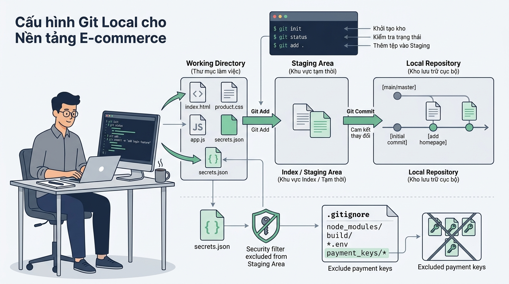

## 
[Sáng tạo] Xây dựng quy trình khởi tạo và kiểm soát phiên bản an toàn cho dự án E-commerce Marketplace

### **1. Mục tiêu**
*   **Vận dụng kiến trúc 3 vùng dữ liệu:** Hiểu và áp dụng chính xác cơ chế chuyển đổi giữa Working Directory, Staging Area và Local Repository trong hệ quản trị phiên bản phân tán (DVCS).
*   **Cấu hình môi trường phát triển doanh nghiệp:** Thiết lập chuẩn hóa danh tính lập trình viên (`user.name`, `user.email`), trình soạn thảo mã nguồn (`core.editor`), và chính sách xuống dòng cross-platform (`core.autocrlf`).
*   **Xây dựng chiến lược loại trừ dữ liệu bảo mật:** Bố trí quy tắc tệp `.gitignore` cho nền tảng E-commerce web framework nhằm ngăn chặn tuyệt đối rò rỉ khóa bí mật thanh toán, tệp môi trường, bộ nhớ tạm hệ điều hành và thư viện phụ thuộc.
*   **Chuẩn hóa lịch sử đóng gói phiên bản:** Thực thi quy trình ghi nhận commit theo chuẩn Conventional Commits (`feat`, `fix`, `docs`, `chore`, `refactor`) giúp lịch sử truy xuất rõ ràng và hỗ trợ truy vấn thông qua `git log`.

### **2. Bối cảnh & Vấn đề**
Doanh nghiệp bán lẻ trực tuyến E-Corp đang khởi chạy dự án hệ thống cổng thanh toán và quản lý đơn hàng đa kênh (E-commerce Order & Payment Gateway). Trong giai đoạn bắt đầu, đội ngũ phát triển bao gồm các kỹ sư làm việc trên nhiều hệ điều hành khác nhau (Windows, macOS, Linux). 

Nếu không thiết lập quy trình kiểm soát phiên bản ngay từ đầu, dự án sẽ đối mặt với các nguy cơ nghiêm trọng như: rò rỉ khóa API bí mật của đối tác thanh toán (PayPal, Stripe) do vô tình đẩy tệp cấu hình môi trường `.env` vào lịch sử; xung đột mã nguồn do sự khác biệt giữa ký tự xuống dòng `CRLF` và `LF`; phình to dung lượng kho chứa dữ liệu do đưa các thư viện đóng gói `node_modules/` hoặc tệp biên dịch `dist/` vào vùng chờ Staging. 

Học viên đóng vai trò là Kiến trúc sư phần mềm (Software Architect), chịu trách nhiệm thiết kế toàn bộ quy trình khởi tạo kho chứa cục bộ, cấu hình danh tính chuẩn, quy tắc chặn tệp rác/dữ liệu nhạy cảm, và mô phỏng chuỗi thao tác lưu vết phiên bản đầu tiên cho nền tảng E-commerce.

  

### **3. Quy tắc nghiệp vụ**
*   **Quy tắc 1 (Danh tính & Môi trường):** Tất cả thao tác commit phải được định danh bằng email doanh nghiệp chuẩn (ví dụ `@company.com`), sử dụng trình soạn thảo VS Code với tham số `--wait` và bật xử lý xuống dòng tự động `core.autocrlf` tương thích với hệ điều hành đang sử dụng.
*   **Quy tắc 2 (Bảo mật & Loại trừ):**
    *   Tuyệt đối loại trừ các tệp chứa thông tin nhạy cảm: `.env`, `.env.production`, các chứng chỉ bảo mật `.pem`, `.key`.
    *   Tuyệt đối loại trừ bộ nhớ tạm hệ điều hành (`.DS_Store`, `Thumbs.db`), tệp cấu hình IDE (`.vscode/`, `.idea/`), và các thư mục biên dịch/phụ thuộc (`node_modules/`, `dist/`, `build/`).
    *   Ngoại lệ bắt buộc: Tệp nhật ký kiểm toán hệ thống `/logs/system-audit.log` phải được giữ lại để theo dõi vết hoạt động mặc dù các tệp nhật ký khác (`*.log`) bị chặn.
*   **Quy tắc 3 (Đóng gói phiên bản):** Các thông điệp commit phải tuân thủ nghiêm ngặt định dạng Conventional Commits: `<type>(<scope>): <description>`. Ví dụ: `feat(order): tích hợp dịch vụ tính phí vận chuyển`.

### **4. Yêu cầu bài toán**

#### **Phần 1: Tự thiết kế Cấu trúc Kho chứa & Cấu hình Danh tính (Schema Design)**
Tự thiết kế bảng thông số cấu hình và cấu trúc thư mục dự án E-commerce trên máy trạm cục bộ.
*   Bảng thông số cấu hình Git CLI (`git config`) bao gồm Scope (Global/Local), Key, Value và mục đích vận hành.
*   Cấu trúc thư mục mô phỏng dự án bao gồm các tệp nguồn, tệp cấu hình môi trường, thư mục chứa kết quả biên dịch và tệp nhật ký.

#### **Phần 2: Chủ động phát hiện Bẫy dữ liệu & Rủi ro An toàn thông tin (Edge Cases)**
Liệt kê tối thiểu 3 tình huống bẫy lỗi và rủi ro thực tế khi vận hành Git CLI trong dự án E-commerce (ví dụ: bẫy lộ mật khẩu database qua staging, bẫy sai lệch ký tự xuống dòng gây hỏng chữ ký số thanh toán, bẫy đưa thư mục rác làm nặng repo). Đề xuất giải pháp ngăn chặn tương ứng cho từng tình huống.

#### **Phần 3: Sơ đồ Luồng Dữ liệu Kiến trúc 3 Vùng (Data Flow Diagram)**
Vẽ sơ đồ luồng dữ liệu bằng định dạng Mermaid thể hiện vòng đời dịch chuyển của các tập tin trong hệ thống E-commerce qua 3 vùng: **Working Directory** `\rightarrow` (thông qua bộ lọc `.gitignore`) `\rightarrow` **Staging Area** `\rightarrow` **Local Repository (DAG Snapshots)**.

#### **Phần 4: Hiện thực hóa Kịch bản Triển khai bằng Git CLI (Implementation)**
Viết chuỗi câu lệnh Git CLI (hoặc kịch bản script shell execution) để thực hiện từ đầu đến cuối các bước sau:
1. Kiểm tra phiên bản Git CLI đang chạy trên hệ thống.
2. Thực thi các lệnh cấu hình danh tính người dùng, editor mặc định và `core.autocrlf`.
3. Khởi tạo kho chứa dữ liệu cục bộ (`git init`) cho thư mục dự án `ecommerce-order-gateway`.
4. Tạo tệp `.gitignore` chuẩn hóa chứa toàn bộ các quy tắc nghiệp vụ loại trừ và quy tắc ngoại lệ đã nêu ở Mục 3.
5. Thực hiện chuỗi thao tác đưa các tệp mã nguồn vào vùng chờ (`git add`) và tạo ít nhất 3 commit lưu vết lịch sử theo chuẩn Conventional Commits tương ứng với các tính năng:
   *   Khởi tạo cấu trúc dự án và tệp loại trừ.
   *   Xây dựng mô-đun xử lý giỏ hàng (`cart`).
   *   Sửa lỗi tính toán khuyến mãi (`discount`).
6. Kiểm tra lại trạng thái làm việc (`git status`) và truy vấn nhật ký lịch sử ở dạng rút gọn một dòng (`git log --oneline`).

### **5. Yêu cầu nộp bài**
Học viên cần nộp:
*   Phần phân tích/báo cáo kịch bản, sơ đồ Mermaid và kịch bản lệnh CLI triển khai.
*   Đẩy mã nguồn và tệp kịch bản lên GitHub theo định dạng thư mục: `[Tên Lớp]_[Môn Học]_Session02_Ex05`.
    Ví dụ: `HNKS25CNTT1_Tooling_Session02_Ex05`