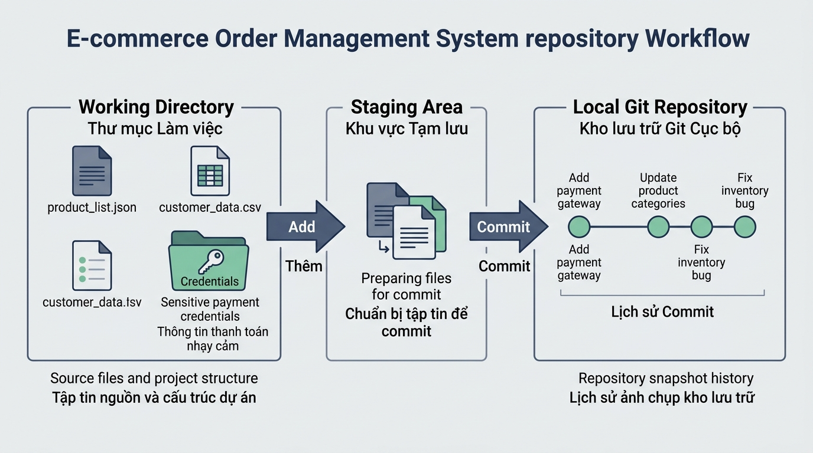

## <center>[Bài tập tổng hợp] Cấu hình môi trường và quản lý kho chứa hệ thống E-Commerce</center>

### **1. Mục tiêu**
*   **Cấu hình môi trường phát triển Git CLI:** Thiết lập chính xác danh tính người dùng toàn cục (`user.name`, `user.email`), trình soạn thảo mặc định (`core.editor`), và quy tắc xử lý ký tự xuống dòng (`core.autocrlf`).
*   **Phân tích kiến trúc 3 vùng dữ liệu:** Vận hành thành công quy trình làm việc giữa thư mục làm việc (Working Directory), vùng chờ (Staging Area), và kho chứa cục bộ (Local Repository).
*   **Xây dựng cơ chế loại trừ tệp tin (.gitignore):** Thiết lập tệp cấu hình `.gitignore` chuẩn hóa cho phân hệ E-Commerce, ngăn chặn nguy cơ lộ dữ liệu nhạy cảm (API key thanh toán, biến môi trường) và phình dung lượng bộ nhớ (tệp log, build artifact).
*   **Thực thi quy chuẩn Conventional Commits:** Đóng gói các thay đổi mã nguồn thành các điểm mốc (Snapshots) với thông điệp theo đúng chuẩn công nghiệp (`feat`, `fix`, `docs`, `chore`).
*   **Truy vấn nhật ký phiên bản:** Sử dụng lệnh `git status` và `git log --oneline` để kiểm tra trạng thái và lịch sử cập nhật mã nguồn hệ thống.

---

### **2. Bối cảnh & Vấn đề**
Doanh nghiệp Thương mại Điện tử "S-Cart" đang triển khai phân hệ xử lý đơn hàng và tích hợp cổng thanh toán trực tuyến. Đội ngũ kỹ thuật cần khởi tạo một kho chứa dữ liệu cục bộ mới để quản lý toàn bộ mã nguồn, tài liệu API và các tệp cấu hình dịch vụ.

Trong đợt kiểm tra an ninh mạng gần đây, hệ thống phát hiện lập trình viên cũ đã vô tình đẩy tệp `.env.production` chứa mật khẩu cơ sở dữ liệu và khóa bí mật của cổng thanh toán PayPal vào kho chứa, đồng thời đưa hàng nghìn tệp phụ thuộc trong `node_modules/` và tệp biên dịch `dist/` khiến kích thước kho chứa phình to đến 800MB. Hơn nữa, lịch sử ghi nhận phiên bản chứa đầy các thông điệp mơ hồ như `"update"`, `"fix lỗi"`, `"code moi"` gây ngưng trệ quá trình kiểm toán mã nguồn.

Là một Kỹ sư Hệ thống, bạn được giao nhiệm vụ chuẩn hóa lại toàn bộ môi trường làm việc Git CLI, khởi tạo lại cấu trúc kho chứa cục bộ chuẩn cho dự án E-Commerce, cấu hình bộ lọc loại trừ tệp nhạy cảm và thực hiện đóng gói lịch sử commit đạt chuẩn doanh nghiệp.


<p align="center">
  
</p>


---

### **3. Quy tắc nghiệp vụ**

#### **Bảng 1: Quy tắc quản lý tệp tin trong phân hệ E-Commerce**

<table style="width: 100%; min-width: 100%; display: table; border-collapse: collapse;" width="100%" border="1">
  <thead>
    <tr style="background-color: #0f172a; color: #ffffff;">
      <th style="padding: 8px; text-align: left;">Loại tệp tin</th>
      <th style="padding: 8px; text-align: left;">Đường dẫn / Tên tệp mẫu</th>
      <th style="padding: 8px; text-align: left;">Quy tắc theo dõi (Tracking Rule)</th>
    </tr>
  </thead>
  <tbody>
    <tr>
      <td style="padding: 8px;">Mã nguồn nghiệp vụ</td>
      <td style="padding: 8px;"><code>src/order_service.js</code>, <code>src/payment_gateway.js</code></td>
      <td style="padding: 8px;">Bắt buộc theo dõi phiên bản (Tracked).</td>
    </tr>
    <tr>
      <td style="padding: 8px;">Tài liệu kỹ thuật</td>
      <td style="padding: 8px;"><code>docs/api_spec.md</code></td>
      <td style="padding: 8px;">Bắt buộc theo dõi phiên bản (Tracked).</td>
    </tr>
    <tr>
      <td style="padding: 8px;">Biến môi trường / Bảo mật</td>
      <td style="padding: 8px;"><code>.env</code>, <code>.env.production</code>, <code>.env.local</code></td>
      <td style="padding: 8px;">Tuyệt đối không đưa vào Staging Area, loại trừ qua <code>.gitignore</code>.</td>
    </tr>
    <tr>
      <td style="padding: 8px;">Kết quả biên dịch & Phụ thuộc</td>
      <td style="padding: 8px;"><code>node_modules/</code>, <code>dist/</code>, <code>build/</code></td>
      <td style="padding: 8px;">Loại trừ hoàn toàn khỏi kho chứa.</td>
    </tr>
    <tr>
      <td style="padding: 8px;">Nhật ký vận hành & Hệ điều hành</td>
      <td style="padding: 8px;"><code>logs/*.log</code>, <code>.DS_Store</code>, <code>Thumbs.db</code></td>
      <td style="padding: 8px;">Loại trừ tất cả các tệp log rác, ngoại lệ giữ lại tệp kiểm toán <code>logs/audit_trail.log</code>.</td>
    </tr>
  </tbody>
</table>

#### **Bảng 2: Chuẩn định dạng thông điệp Conventional Commits**

<table style="width: 100%; min-width: 100%; display: table; border-collapse: collapse;" width="100%" border="1">
  <thead>
    <tr style="background-color: #0f172a; color: #ffffff;">
      <th style="padding: 8px; text-align: left;">Tiền tố (Type)</th>
      <th style="padding: 8px; text-align: left;">Phạm vi (Scope)</th>
      <th style="padding: 8px; text-align: left;">Mục đích sử dụng</th>
    </tr>
  </thead>
  <tbody>
    <tr>
      <td style="padding: 8px;"><code>chore</code></td>
      <td style="padding: 8px;"><code>config</code></td>
      <td style="padding: 8px;">Cập nhật tệp cấu hình hệ thống, cài đặt <code>.gitignore</code>.</td>
    </tr>
    <tr>
      <td style="padding: 8px;"><code>docs</code></td>
      <td style="padding: 8px;"><code>api</code></td>
      <td style="padding: 8px;">Thêm mới hoặc chỉnh sửa tài liệu mô tả REST API.</td>
    </tr>
    <tr>
      <td style="padding: 8px;"><code>feat</code></td>
      <td style="padding: 8px;"><code>order</code></td>
      <td style="padding: 8px;">Phát triển tính năng mới liên quan đến quản lý đơn hàng.</td>
    </tr>
    <tr>
      <td style="padding: 8px;"><code>fix</code></td>
      <td style="padding: 8px;"><code>payment</code></td>
      <td style="padding: 8px;">Khắc phục sự cố xử lý giao dịch hoặc kết nối cổng thanh toán.</td>
    </tr>
  </tbody>
</table>

---

### **4. Yêu cầu bài toán**

Học viên mở công cụ Terminal/Command Prompt trên máy cục bộ và thực hiện tuần tự các bước sau:

#### **Bước 1: Cấu hình thông tin môi trường làm việc toàn cục (Global Scope)**
1. Thiết lập tên người dùng hiển thị: `"Dev ECommerce"`.
2. Thiết lập email doanh nghiệp: `"dev.ecommerce@scart.vn"`.
3. Thiết lập trình soạn thảo văn bản mặc định là Visual Studio Code với tham số chờ (`"code --wait"`).
4. Thiết lập quy tắc tự động xử lý ký tự xuống dòng `core.autocrlf` là `true` (nếu dùng Windows) hoặc `input` (nếu dùng macOS/Linux).
5. Thực thi câu lệnh kiểm tra lại toàn bộ thông số cấu hình đã lưu.

#### **Bước 2: Khởi tạo thư mục và cấu trúc dự án E-Commerce**
1. Khởi tạo một kho chứa dữ liệu cục bộ Git hoàn toàn mới trong thư mục dự án đặt tên là `ecommerce-order-system`.
2. Tạo cấu trúc cây thư mục và tệp tin ban đầu như sau:
   ```text
   ecommerce-order-system/
   ├── src/
   │   ├── order_service.js
   │   └── payment_gateway.js
   ├── docs/
   │   └── api_spec.md
   ├── logs/
   │   ├── system_debug.log
   │   └── audit_trail.log
   ├── dist/
   │   └── app.bundle.js
   ├── .env
   └── .env.production
   ```

#### **Bước 3: Xây dựng tệp cấu hình loại trừ `.gitignore`**
1. Tạo tệp `.gitignore` nằm tại thư mục gốc dự án.
2. Khai báo các quy tắc loại trừ theo đúng chuẩn:
   * Chặn toàn bộ các tệp môi trường có chứa từ khóa `.env` (ví dụ: `.env`, `.env.production`, `.env.local`).
   * Chặn thư mục chứa kết quả đóng gói biên dịch `dist/` và thư mục thư viện `node_modules/`.
   * Chặn tất cả các tệp nhật ký trong thư mục `logs/` có đuôi `.log`, nhưng **bắt buộc dùng cú pháp phủ định (`!`) để giữ lại tệp kiểm toán `logs/audit_trail.log`**.
   * Chặn các tệp ẩn của hệ điều hành như `.DS_Store` và `Thumbs.db`.

#### **Bước 4: Thực thi quy trình Staging và Commit theo chuẩn Conventional Commits**
Thực hiện chuyển các tệp tin vào vùng chờ (Staging Area) và ghi nhận phiên bản lưu trữ với 4 bước commit riêng biệt:
1. **Commit 1:** Chuyển tệp `.gitignore` vào Staging Area và tạo commit với nội dung:
   `chore(config): khoi tao tep ignore bao mat va cau truc du an`
2. **Commit 2:** Chuyển tệp `docs/api_spec.md` vào Staging Area và tạo commit với nội dung:
   `docs(api): bo sung tai lieu tich hop cong thanh toan online`
3. **Commit 3:** Chuyển tệp `src/order_service.js` vào Staging Area và tạo commit với nội dung:
   `feat(order): phat trien luong tao va kiem tra trang thai don hang`
4. **Commit 4:** Chuyển các tệp `src/payment_gateway.js` và `logs/audit_trail.log` vào Staging Area và tạo commit với nội dung:
   `fix(payment): xu ly loi timeout khi ket noi cong thanh toan paypal`

#### **Bước 5: Truy vấn và kiểm chuẩn trạng thái kho chứa**
1. Thực thi câu lệnh kiểm tra trạng thái kho chứa để đảm bảo các tệp `.env`, `.env.production`, `dist/app.bundle.js` và `logs/system_debug.log` **không bị Git theo dõi** và nằm đúng ngoài vùng Staging Area.
2. Thực thi câu lệnh xem lịch sử nhật ký ở dạng rút gọn 1 dòng (`--oneline`) để xác nhận đúng chuỗi 4 commit đã tạo.

---

### **5. Yêu cầu nộp bài**
Học viên cần nộp:
*   Phần phân tích/báo cáo và mã nguồn triển khai.
*   Đẩy mã nguồn lên GitHub theo định dạng thư mục: `[Tên Lớp]_[Môn Học]_Session02_Ex06`.
    Ví dụ: `HNKS25CNTT1_Tooling_Session02_Ex06`