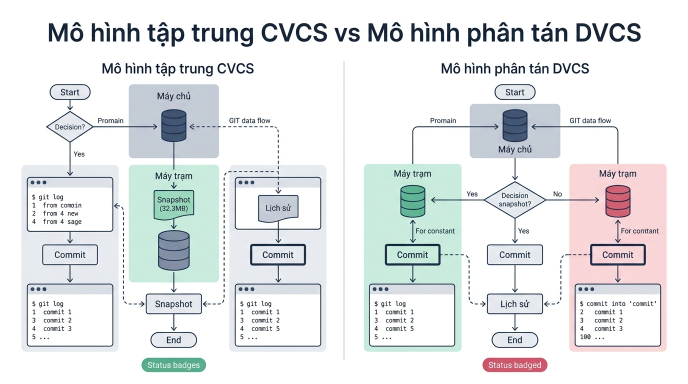
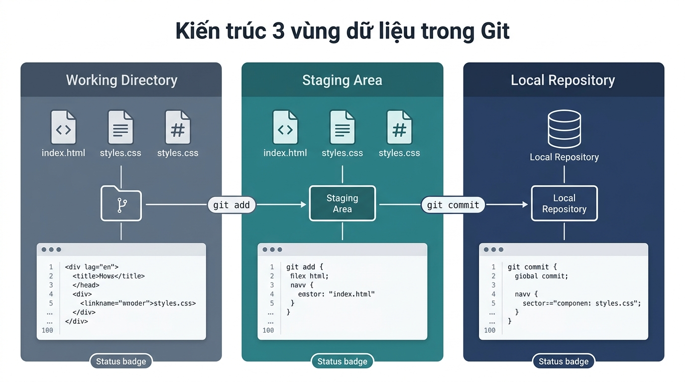

```markmap
# Cấu trúc kho chứa & Lệnh Git CLI cơ bản

## Mục tiêu bài học
- Hiểu kiến trúc phân tán DVCS và cơ chế Snapshot của Git
- Thành thạo cấu hình danh tính người dùng và môi trường Git CLI 2.45+
- Nắm vững kiến trúc 3 vùng dữ liệu và quản lý tệp rác với .gitignore
- Thực hành lưu phiên bản chuẩn hóa theo quy tắc Conventional Commits

## Đặt tình huống
- Xảy ra rủi ro ghi đè mã nguồn khi làm việc nhóm theo cách thủ công
- Hệ thống CVCS tập trung bị ngưng trệ hoàn toàn khi máy chủ gặp sự cố
- Repository bị phình dung lượng do lỡ lưu thư mục node_modules và tệp .env lộ mật khẩu

## Tổng quan hệ thống quản lý phiên bản Git
### Khái niệm DVCS
- Hệ thống kiểm soát phiên bản phân tán, cho phép lưu trữ toàn bộ lịch sử offline.
### Cơ chế Snapshot
- Lưu ảnh chụp trạng thái hệ thống tại thời điểm commit, tối ưu tốc độ và an toàn.
### Minh họa luồng

### Lưu ý
- Hệ thống CVCS phụ thuộc mạng, DVCS cho phép truy vấn nhật ký hoàn toàn cục bộ.

## Cài đặt & Cấu hình môi trường Git CLI
### Cấu hình toàn cục
- Thiết lập danh tính lập trình viên và trình soạn thảo mặc định trên máy trạm.
### Cú pháp thiết lập
  ```bash
  git config --global user.name "Nguyen Van A"
  git config --global user.email "a.nguyen@company.com"
  git config --global core.editor "code --wait"
  ```
### Truy vấn cấu hình
  ```bash
  git config --global --list
  ```
### Lưu ý
- Bọc tên có khoảng trắng trong ngoặc kép và sử dụng email doanh nghiệp chính thức.

## Khởi tạo kho chứa & Kiến trúc 3 vùng dữ liệu
### 3 Vùng dữ liệu
- Working Directory (Thư mục làm việc), Staging Area (Vùng chờ), Local Repository (Kho chứa).
### Minh họa luồng

### Cú pháp khởi tạo
  ```bash
  git init
  git status
  ```
### Trạng thái tệp
- Untracked (Chưa theo dõi) và Tracked (Đã theo dõi: Unmodified, Modified, Staged).

## Quản lý vùng chờ Staging & Tập tin loại trừ .gitignore
### Vùng chờ Staging
- Chuẩn bị danh sách các thay đổi cần đóng gói trước khi lưu trữ chính thức.
### Tệp loại trừ .gitignore
- Loại bỏ thư mục phụ thuộc nặng và tệp môi trường nhạy cảm khỏi Git.
### Cấu pháp .gitignore mẫu
  ```text
  node_modules/
  dist/
  .env
  ```
### Lưu ý
- Tạo tệp .gitignore ngay khi khởi tạo dự án để tránh rò rỉ bí mật hệ thống.

## Ghi nhận phiên bản Commit & Chuẩn Conventional Commits
### Chuẩn Conventional Commits
- Tiêu chuẩn đặt thông điệp commit: `<type>(<scope>): <description>` (feat, fix, docs).
### Cú pháp thực thi
  ```bash
  git add .
  git commit -m "feat(auth): bổ sung đăng nhập Google OAuth2"
  ```
### Nhật ký lịch sử
  ```bash
  git log --oneline
  ```
### Lưu ý
- Thực hiện commit nhỏ gọn (atomic commit) với thông điệp rõ ràng, đúng ngữ nghĩa.
```