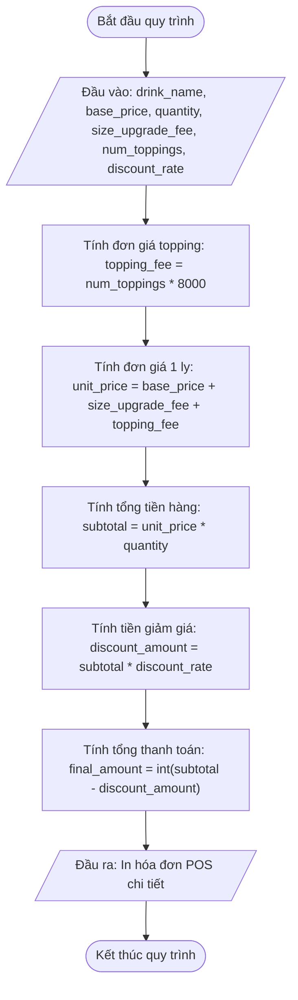

### **Tiêu chí chấm điểm (AI)**
**[Phân tích 1] Phân tích và Thiết kế Module Tính Tiền Hóa đơn POS Trà Sữa Highlands — Tổng điểm: 100 điểm**

---

#### **1. Báo cáo Đề xuất đa giải pháp & So sánh Trade-off — 30 điểm**
*   **[15 điểm] Mô tả ít nhất 2 giải pháp kỹ thuật:**
    *   Đề xuất đầy đủ và phân biệt rõ ràng kiến trúc 2 phương án (Ví dụ: Phương án 1 - Khai báo biến trung gian chia nhỏ từng nấc tính toán vs Phương án 2 - Sử dụng biểu thức tính toán gộp trực tiếp khi in hóa đơn).
    *   Phân tích cấu trúc dữ liệu và sự khác biệt trong luồng xử lý bộ nhớ.
*   **[15 điểm] Bảng so sánh Trade-off trực quan:**
    *   Trình bày đúng định dạng bảng HTML với style bắt buộc (`style="width: 100%; min-width: 100%; display: table; border-collapse: collapse;"`).
    *   Đánh giá đầy đủ và chính xác 5 tiêu chí: Execution Speed, Memory Usage, Maintainability, Readability, Suitability.

---

#### **2. Giải trình Lựa chọn và Mã giả thiết kế — 20 điểm**
*   **[10 điểm] Lý giải logic khoa học cho lựa chọn:**
    *   Lý giải thuyết phục lý do chọn phương án (ví dụ chọn phương án tách biến trung gian giúp dễ kiểm tra bug giá trị từng dòng trên hóa đơn POS, dễ bảo trì khi chính sách giá thay đổi).
*   **[10 điểm] Viết mã giả/Lưu đồ luồng tối ưu:**
    *   Vẽ Mermaid Flowchart chính xác, tuân thủ 100% chuẩn hình dạng:
        *   Oval `([Start/End])` cho Terminator.
        *   Parallelogram `[/Input/Output/]` cho Nhập/Xuất.
        *   Rectangle `["Process"]` cho các bước tính toán đại số.
    *   Ví dụ sơ đồ chuẩn:

---

#### **3. Triển khai mã nguồn logic nghiệp vụ — 30 điểm**
*   **[15 điểm] Hiện thực hóa phương án tối ưu bằng code:**
    *   Viết chương trình Python thực thi tính toán chính xác theo đúng công thức nghiệp vụ.
    *   Đoạn mã chạy không có lỗi syntax, kết quả tính toán chính xác 100%.
*   **[15 điểm] Chặn các lỗi logic biên nghiệp vụ:**
    *   Thực hiện ép kiểu dữ liệu từ `input()` chính xác (`int(input())` cho giá tiền/số lượng, `float(input())` cho tỷ lệ giảm giá).
    *   Tránh hoàn toàn lỗi cộng/nhân chuỗi (string concatenation) gây sai lệch dữ liệu tài chính.

---

#### **4. Kiểm chuẩn dữ liệu và Định dạng Đầu ra — 10 điểm**
*   **[10 điểm] Trả về chuẩn cấu trúc dữ liệu:**
    *   Đầu ra màn hình hiển thị đầy đủ, rõ ràng từng mục hóa đơn POS (Tên món, Đơn giá gốc, Phụ thu Size, Phụ thu Topping, Đơn giá 1 ly, Số lượng, Tổng tiền hàng, Tiền giảm giá, Tổng thanh toán).
    *   Định dạng tiền tệ rõ ràng (ví dụ có đuôi VNĐ).

---

#### **5. Chất lượng mã nguồn và Quy chuẩn nộp bài — 10 điểm**
*   **[5 điểm] Đặt tên biến và Clean Code:**
    *   Đặt tên biến hoàn toàn bằng tiếng Anh chuẩn (`base_price`, `quantity`, `subtotal`, `final_amount`).
    *   Mã nguồn sạch đẹp, có chú thích bằng tiếng Việt có dấu giải thích logic nghiệp vụ.
*   **[5 điểm] Nộp bài GitHub:**
    *   Đường dẫn GitHub hợp lệ, đúng cấu trúc thư mục quy định (`[Tên Lớp]_[Môn Học]_SessionSESSION_01_Ex10`).

---

#### **Điểm cộng khuyến khích (Bonus) — 10 điểm**
*   **[10 điểm] Xử lý trình bày hóa đơn chuyên nghiệp:**
    *   Sử dụng định dạng chuỗi nâng cao (f-string alignment/padding) để in hóa đơn cân đối giống phiếu in POS thực tế, hoặc có kịch bản test kiểm thử đa dạng các ca nhập liệu biên (ví dụ số lượng = 0, discount_rate = 0.0).