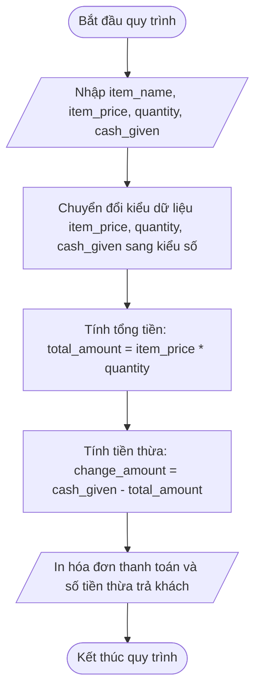

## <center>[Vận dụng cơ bản 1] Sửa lỗi tính tổng tiền hóa đơn POS tại quầy Highlands Coffee</center>

### **1. Mục tiêu**
*   Hiểu và vận dụng đúng quy tắc khai báo biến, nhập dữ liệu từ bàn phím bằng hàm `input()` và chuyển đổi kiểu dữ liệu (`int`, `float`) trong ngôn ngữ lập trình Python.
*   Rèn luyện kỹ năng đọc mã nguồn (code tracing), phân tích lỗi sai lệch kiểu dữ liệu (Data Type Mismatch) khi thực hiện các phép toán số học trong phần mềm POS thực tế.
*   Sửa lỗi thành công module tính tổng tiền thanh toán và số tiền thừa trả lại cho khách hàng tại quầy thu ngân Highlands Coffee.

### **2. Bối cảnh & Vấn đề**
Tại các cửa hàng Highlands Coffee, hệ thống máy tính tiền (POS Terminal) chạy ứng dụng CLI để hỗ trợ thu ngân ghi nhận đơn hàng mua tại quầy. Chương trình nhận dữ liệu đầu vào bao gồm: tên món uống, đơn giá niêm yết của món, số lượng ly khách đặt và số tiền mặt khách hàng đưa cho thu ngân.

Hệ thống POS hiện tại đang gặp sự cố nghiêm trọng tại quầy thu ngân. Thu ngân phản ánh rằng khi nhập giá đơn hàng cho ly Phin Sữa Đá là `39000` VNĐ, số lượng `2` ly và tiền khách đưa là `100000` VNĐ, phần mềm lập tức bị crash (ngắt đột ngột) và báo lỗi hệ thống không thể tính toán số học trên kiểu dữ liệu nhập vào. Điều này dẫn đến việc không thể xuất hóa đơn và gây ùn tắc tại quầy thanh toán vào giờ cao điểm.### **3. Mã nguồn hiện tại**
Dưới đây là đoạn mã nguồn Python hiện tại của module tính tiền hóa đơn đang vận hành tại hệ thống POS:

```python
# Highlands POS - Module tính tiền hóa đơn tại quầy

# 1. Nhập thông tin đơn hàng từ bàn phím
item_name = input("Nhập tên thức uống: ")
item_price = input("Nhập đơn giá niêm yết (VNĐ): ")
quantity = input("Nhập số lượng mua: ")
cash_given = input("Nhập số tiền khách đưa (VNĐ): ")

# 2. Tính toán tổng tiền và tiền thừa trả lại khách
total_amount = item_price * quantity
change_amount = cash_given - total_amount

# 3. Xuất hóa đơn thanh toán cho khách hàng
print("----------------------------------------")
print(f"HÓA ĐƠN BÁN HÀNG - HIGHLANDS POS")
print(f"Sản phẩm: {item_name}")
print(f"Số lượng: {quantity}")
print(f"Tổng tiền thanh toán: {total_amount} VNĐ")
print(f"Tiền thừa trả khách: {change_amount} VNĐ")
print("----------------------------------------")
```

Dưới đây là sơ đồ dòng chảy dữ liệu (Flowchart) mô tả quy tắc nghiệp vụ tính hóa đơn đúng chuẩn:



### **4. Yêu cầu đầu ra**

#### **Nhiệm vụ 1: Phân tích & Báo cáo lỗi (Test Case Report Table)**
Học viên thực hiện đọc mã nguồn, chạy thử chương trình để phát hiện vị trí gây lỗi, sau đó hoàn thiện bảng báo cáo kịch bản kiểm thử bên dưới (điền thông tin vào các vị trí dấu `...` ở Dòng 2 và Dòng 3).

<table style="width: 100%; min-width: 100%; display: table; border-collapse: collapse;" width="100%" border="1" cellpadding="8">
  <thead>
    <tr style="background-color: #f2f2f2;">
      <th style="text-align: center; width: 5%;">STT</th>
      <th style="text-align: left; width: 25%;">Đầu vào (Input)</th>
      <th style="text-align: left; width: 25%;">Kết quả lỗi thực tế (Buggy Output)</th>
      <th style="text-align: left; width: 20%;">Kết quả mong đợi (Expected Output)</th>
      <th style="text-align: center; width: 10%;">Dòng code gây lỗi</th>
      <th style="text-align: left; width: 15%;">Nguyên nhân lỗi logic</th>
    </tr>
  </thead>
  <tbody>
    <tr>
      <td style="text-align: center;">1</td>
      <td>
        item_name = "Phin Sữa Đá"<br>
        item_price = "39000"<br>
        quantity = "2"<br>
        cash_given = "100000"
      </td>
      <td>
        TypeError: can't multiply sequence by non-int of type 'str' (Chương trình bị ngắt đột ngột)
      </td>
      <td>
        Tổng tiền: 78000 VNĐ<br>
        Tiền thừa: 22000 VNĐ
      </td>
      <td style="text-align: center;">Dòng 9</td>
      <td>
        Hàm <code>input()</code> trả về kiểu dữ liệu chuỗi <code>str</code>. Thực hiện phép nhân hai chuỗi gây ra lỗi runtime.
      </td>
    </tr>
    <tr>
      <td style="text-align: center;">2</td>
      <td>
        item_name = "Trà Sen Vàng"<br>
        item_price = "45000"<br>
        quantity = "3"<br>
        cash_given = "200000"
      </td>
      <td>...</td>
      <td>...</td>
      <td style="text-align: center;">...</td>
      <td>...</td>
    </tr>
    <tr>
      <td style="text-align: center;">3</td>
      <td>
        item_name = "Freeze Trà Xanh"<br>
        item_price = "55000"<br>
        quantity = "1"<br>
        cash_given = "100000"
      </td>
      <td>...</td>
      <td>...</td>
      <td style="text-align: center;">...</td>
      <td>...</td>
    </tr>
  </tbody>
</table>

#### **Nhiệm vụ 2: Sửa mã nguồn chương trình Python**
*   Tiến hành sửa lại đoạn mã nguồn legacy sao cho nhận dữ liệu đầu vào và chuyển đổi đúng định dạng kiểu số (`int` cho số lượng, `int` hoặc `float` cho giá tiền và tiền khách đưa).
*   Đảm bảo chương trình tính toán chính xác tổng tiền thanh toán (`total_amount`) và tiền thừa (`change_amount`).
*   In kết quả hóa đơn ra màn hình console rõ ràng, đúng format mẫu theo đúng yêu cầu nghiệp vụ.

### **5. Yêu cầu nộp bài**
Học viên cần nộp:
*   Phần phân tích/báo cáo và mã nguồn triển khai.
*   Đẩy mã nguồn lên GitHub theo định dạng thư mục: `[Tên Lớp]_[Môn Học]_SessionSESSION_01_Ex1`.
    Ví dụ: `HNKS25CNTT1_Core_Session_SESSION_01_Ex1`