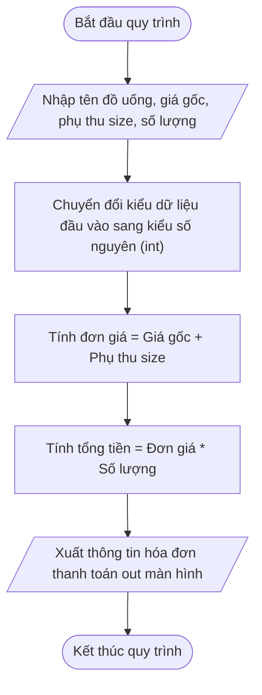

## <center>[Vận dụng cơ bản 2] Sửa lỗi tính hóa đơn thanh toán tại quầy POS</center>

### **1. Mục tiêu**
* **Khai báo và xử lý nhập/xuat dữ liệu:** Sử dụng thành thạo hàm `input()` và `print()` trong Python để tương tác với người dùng qua giao diện CLI.
* **Ép kiểu dữ liệu (Type Casting):** Hiểu rõ bản chất dữ liệu trả về từ hàm `input()` và thực hiện ép kiểu từ `str` sang `int` hoặc `float` để phục vụ các phép toán số học.
* **Phát hiện và khắc phục lỗi ghép chuỗi:** Nhận biết lỗi logic khi thao tác toán tử `+` và `*` trên kiểu dữ liệu chuỗi thay vì kiểu số trong mô đun tính hóa đơn của hệ thống Highlands POS.

### **2. Bối cảnh & Vấn đề**
Tại chuỗi quán cà phê Highlands POS, hệ thống phần mềm tính tiền tại quầy (POS Receipt Subsystem) chịu trách nhiệm nhận thông tin nhập vào từ nhân viên thu ngân bao gồm: tên đồ uống, giá niêm yết (size S), phụ thu kích thước (size M/L) và số lượng ly khách đặt.

Tuy nhiên, bộ phận vận hành cửa hàng vừa ghi nhận một sự cố: Khi nhân viên thu ngân nhập thông tin thanh toán cho khách hàng mua 2 ly Trà Đào Cam Sả size M (giá gốc 45.000 VNĐ, phụ thu size M là 6.000 VNĐ), hóa đơn in ra báo tổng tiền lên tới hàng trăm tỷ đồng (`450006000450006000 VNĐ`). Sự cố này khiến hóa đơn tạm tính bị sai lệch hoàn toàn, làm gián đoạn quy trình thanh toán tại quầy.### **3. Mã nguồn hiện tại**
Dưới đây là mã nguồn Python đang được thực thi trên máy POS tại quầy:

```python
# Module: PosReceiptCalculator.py
# System: Highlands POS - Coffee Billing Subsystem

print("=== HỆ THỐNG TÍNH HÓA ĐƠN HIGHLANDS POS ===")

# Nhập thông tin đơn hàng từ bàn phím
item_name = input("Nhập tên đồ uống: ")
base_price = input("Nhập giá tiền gốc của đồ uống (VNĐ): ")
size_fee = input("Nhập phụ thu size (M: 6000, L: 10000): ")
quantity = input("Nhập số lượng đồ uống: ")

# Tính toán tổng giá trị đơn hàng
unit_price = base_price + size_fee
total_payment = unit_price * quantity

# Hiển thị thông tin hóa đơn ra màn hình
print("\n--- HÓA ĐƠN THANH TOÁN ---")
print("Tên đồ uống:", item_name)
print("Đơn giá 1 ly (đã cộng phụ thu size):", unit_price)
print("Số lượng mua:", quantity)
print("Tổng tiền thanh toán:", total_payment, "VNĐ")
```

Quy trình xử lý tính tiền chuẩn được mô tả qua sơ đồ sau:



### **4. Yêu cầu bài toán**

#### **Phần 1: Báo cáo phân tích vết lỗi (Code Tracing & Bug Report Table)**
Học viên tiến hành chạy thử đoạn mã trên, phân tích nguyên nhân gây ra sự cố và hoàn thành bảng báo cáo Test Case dưới đây vào bài nộp. Dòng STT 1 là mẫu phân tích tham khảo, học viên cần hoàn thiện nốt các dòng còn lại:

<table style="width: 100%; min-width: 100%; display: table; border-collapse: collapse;" width="100%" border="1" cellpadding="8">
  <thead>
    <tr style="background-color: #f2f2f2;">
      <th style="text-align: center; width: 5%;">STT</th>
      <th style="text-align: left; width: 25%;">Dữ liệu đầu vào (Input)</th>
      <th style="text-align: left; width: 20%;">Kết quả hiện tại (Buggy Output)</th>
      <th style="text-align: left; width: 20%;">Kết quả mong đợi (Expected Output)</th>
      <th style="text-align: center; width: 10%;">Dòng code gây lỗi</th>
      <th style="text-align: left; width: 20%;">Giải thích nguyên nhân (Logic Note)</th>
    </tr>
  </thead>
  <tbody>
    <tr>
      <td style="text-align: center;">1</td>
      <td>
        item_name = "Trà Đào Cam Sả"<br/>
        base_price = "45000"<br/>
        size_fee = "6000"<br/>
        quantity = "2"
      </td>
      <td>
        unit_price = "450006000"<br/>
        total_payment = "450006000450006000"
      </td>
      <td>
        unit_price = 51000<br/>
        total_payment = 102000
      </td>
      <td style="text-align: center;">Dòng 12, 13</td>
      <td>Hàm input() trả về kiểu str. Toán tử + thực hiện nối chuỗi ("45000" + "6000" = "450006000") và toán tử * thực hiện nhân bản chuỗi.</td>
    </tr>
    <tr>
      <td style="text-align: center;">2</td>
      <td>
        item_name = "Cà Phê Phin Sữa"<br/>
        base_price = "29000"<br/>
        size_fee = "10000"<br/>
        quantity = "3"
      </td>
      <td>...</td>
      <td>...</td>
      <td style="text-align: center;">...</td>
      <td>...</td>
    </tr>
    <tr>
      <td style="text-align: center;">3</td>
      <td>
        item_name = "Freeze Trà Xanh"<br/>
        base_price = "55000"<br/>
        size_fee = "0"<br/>
        quantity = "4"
      </td>
      <td>...</td>
      <td>...</td>
      <td style="text-align: center;">...</td>
      <td>...</td>
    </tr>
  </tbody>
</table>

#### **Phần 2: Khắc phục mã nguồn Python**
[REQUIREMENT] Học viên viết lại chương trình Python hoàn chỉnh, thực hiện chuyển đổi kiểu dữ liệu đầu vào thích hợp từ bàn phím để các phép tính số học ra kết quả chính xác đúng theo nghiệp vụ tính hóa đơn của Highlands POS.

### **5. Yêu cầu nộp bài**
Học viên cần nộp:
* Phần phân tích/báo cáo bảng Test Case và mã nguồn đã khắc phục hoàn chỉnh.
* Đẩy mã nguồn lên GitHub theo định dạng thư mục: `[Tên Lớp]_[Môn Học]_SessionSESSION_01_Ex2`.
  Ví dụ: `HNKS25CNTT1_Core_Session_SESSION_01_Ex2`