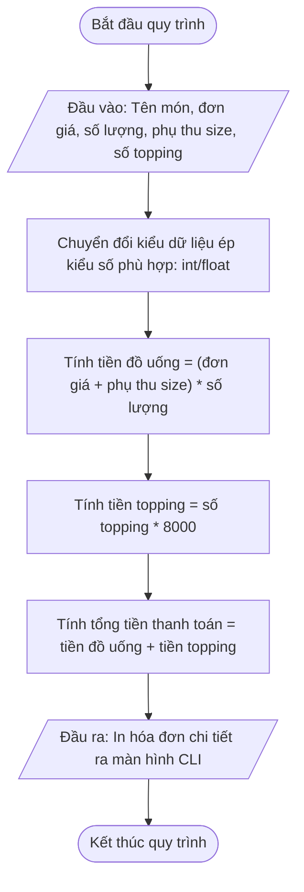

# <center>[Vận dụng cơ bản 4] Sửa lỗi tính tổng tiền hóa đơn POS khi xử lý kiểu dữ liệu đầu vào</center>

### **1. Mục tiêu**
*   Vận dụng kiến thức về khai báo biến, nhập xuất dữ liệu (`input()`, `print()`) và chuyển đổi kiểu dữ liệu (`int()`, `float()`) trong Python.
*   Thực hành kỹ năng đọc hiểu mã nguồn, trace code và phát hiện lỗi sai kiểu dữ liệu (Data Type Mismatch / Type Concatenation Error) khi thực hiện các phép toán với dữ liệu nhập từ bàn phím.
*   Xây dựng bảng phân tích chạy thử nghiệm (Test Case Tracing) và sửa lại mã nguồn hoàn chỉnh theo đúng quy tắc nghiệp vụ tính hóa đơn Highlands POS.

### **2. Bối cảnh & Vấn đề**
Chuỗi cửa hàng trà sữa Highlands POS đang ứng dụng một mô-đun phần mềm CLI nhỏ viết bằng Python để hỗ trợ thu ngân tính tiền nhanh tại quầy. Chương trình cho phép nhập tên món ăn/đồ uống, đơn giá niêm yết, số lượng đặt mua, phụ thu đổi size (Size S: 0 VNĐ, Size M: 6.000 VNĐ, Size L: 10.000 VNĐ) và số lượng topping đi kèm (đồng giá 8.000 VNĐ/topping).

Tuy nhiên, trong quá trình vận hành thực tế tại quầy, thu ngân phản ánh rằng bất cứ khi nào nhập số lượng topping lớn hơn 0, hệ thống lập tức báo lỗi đỏ dừng chương trình đột ngột, làm treo giao diện POS và không thể in được hóa đơn thanh toán cho khách. Bộ phận kỹ thuật cần bạn hỗ trợ kiểm thử và khắc phục sự cố này.

### **3. Mã nguồn hiện tại**
Dưới đây là mã nguồn Python đang chạy tại hệ thống quầy thu ngân:

```python

# Chương trình tính tổng tiền hóa đơn tại quầy POS

# Hệ thống POS - Highlands Coffee / Trà sữa

# Nhập dữ liệu đơn hàng từ bàn phím
item_name = input("Nhập tên đồ uống: ")
unit_price = float(input("Nhập đơn giá đồ uống (VNĐ): "))
quantity = int(input("Nhập số lượng (ly): "))
size_extra = float(input("Nhập phụ thu size (VNĐ - S:0, M:6000, L:10000): "))
topping_count = input("Nhập số lượng topping (8.000 VNĐ/topping): ")

# Tính toán chi phí
drink_subtotal = (unit_price + size_extra) * quantity
topping_subtotal = topping_count * 8000
total_amount = drink_subtotal + topping_subtotal

# In hóa đơn thanh toán
print("----------------------------------------")
print("          HÓA ĐƠN THANH TOÁN            ")
print("----------------------------------------")
print("Sản phẩm:", item_name)
print("Số lượng:", quantity)
print("Tiền đồ uống:", drink_subtotal, "VNĐ")
print("Tiền topping:", topping_subtotal, "VNĐ")
print("Tổng tiền thanh toán:", total_amount, "VNĐ")
print("----------------------------------------")
```

# **4. Yêu cầu đầu ra**

#### **Phần 1: Phân tích & Báo cáo vết mã nguồn (Test Case Report Table)**
Học viên tiến hành chạy thử chương trình (hoặc trace code bằng tay), phát hiện chính xác dòng mã nguồn gây ra lỗi xung đột kiểu dữ liệu và điền đầy đủ thông tin vào bảng báo cáo kiểm thử bên dưới.

<table style="width: 100%; min-width: 100%; display: table; border-collapse: collapse;" width="100%" border="1" cellpadding="8">
  <thead>
    <tr style="background-color: #f2f2f2;">
      <th style="width: 5%;">STT</th>
      <th style="width: 25%;">Dữ liệu đầu vào (Input)</th>
      <th style="width: 20%;">Kết quả hiện tại (Buggy Output)</th>
      <th style="width: 20%;">Kết quả mong đợi (Expected Output)</th>
      <th style="width: 15%;">Dòng code gây lỗi (Failing Line)</th>
      <th style="width: 15%;">Giải thích nguyên nhân (Logic Note)</th>
    </tr>
  </thead>
  <tbody>
    <tr>
      <td>1</td>
      <td>Tên: Trà Milk Tea<br>Đơn giá: 45000<br>Số lượng: 2<br>Phụ thu size: 6000<br>Topping: 2</td>
      <td>TypeError: unsupported operand type(s) for +: 'float' and 'str'</td>
      <td>Tiền đồ uống: 102000.0 VNĐ<br>Tiền topping: 16000.0 VNĐ<br>Tổng tiền: 118000.0 VNĐ</td>
      <td>Dòng 8 & Dòng 12</td>
      <td>Biến topping_count nhận từ input() có kiểu str. Phép nhân '2'*8000 tạo ra chuỗi dài, sau đó phép cộng float + str ở dòng 12 gây ra lỗi crash chương trình.</td>
    </tr>
    <tr>
      <td>2</td>
      <td>Tên: Cà phê Sữa Đá<br>Đơn giá: 35000<br>Số lượng: 1<br>Phụ thu size: 0<br>Topping: 1</td>
      <td>...</td>
      <td>...</td>
      <td>...</td>
      <td>...</td>
    </tr>
    <tr>
      <td>3</td>
      <td>Tên: Trà Ô Long Vải<br>Đơn giá: 55000<br>Số lượng: 3<br>Phụ thu size: 10000<br>Topping: 0</td>
      <td>...</td>
      <td>...</td>
      <td>...</td>
      <td>...</td>
    </tr>
  </tbody>
</table>

Sơ đồ dòng chảy xử lý chuẩn (Flowchart) của mô-đun tính tiền hóa đơn POS:



# **Phần 2: Sửa lỗi và viết lại mã nguồn hoàn chỉnh**
Dựa trên kết quả phân tích lỗi ở Phần 1, học viên chỉnh sửa mã nguồn Python để chương trình chuyển đổi đúng kiểu dữ liệu của tất cả các đầu vào từ bàn phím, thực hiện tính toán chính xác và in ra hóa đơn thanh toán chuẩn xác.

### **5. Yêu cầu nộp bài**
Học viên cần nộp:
*   Phần phân tích/báo cáo (hoàn thiện bảng Test Case) và mã nguồn triển khai đã sửa lỗi hoàn chỉnh.
*   Đẩy mã nguồn lên GitHub theo định dạng thư mục: [Tên Lớp]_[Môn Học]_SessionSESSION_01_Ex4.
    Ví dụ: HNKS25CNTT1_Core_Session_SESSION_01_Ex4
