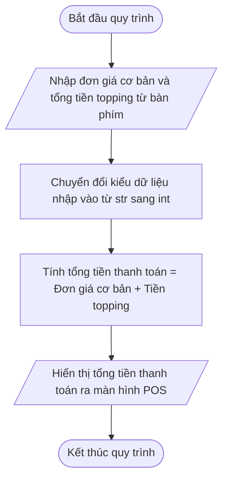

# <center>[Vận dụng cơ bản 5] Sửa lỗi tính tổng tiền hóa đơn order tại quầy Highlands POS</center>

### **1. Mục tiêu**
*   **Phân tích và phát hiện lỗi kiểu dữ liệu (Data Types):** Nhận diện lỗi phát sinh khi xử lý dữ liệu nhận từ hàm `input()` trong Python dưới dạng chuỗi kí tự (`str`).
*   **Thực hành ép kiểu (Type Casting):** Sử dụng chính xác hàm `int()` hoặc `float()` để chuyển đổi dữ liệu đầu vào trước khi thực hiện các phép toán số học.
*   **Củng cố kiến thức Nhập / Xuất dữ liệu:** Viết mã nguồn đọc dữ liệu từ bàn phím và xuất kết quả hóa đơn bán hàng đúng quy chuẩn định dạng cho hệ thống Highlands POS.

### **2. Bối cảnh & Vấn đề**
Trong hệ thống phần mềm quản lý bán hàng tại quầy Highlands POS, thu ngân thực hiện nhập thông tin hóa đơn tạm tính cho khách hàng gồm: **Đơn giá ly đồ uống cơ bản (Size S)** và **Tổng tiền topping đi kèm**.

Tuy nhiên, bộ phận vận hành ghi nhận phản ánh từ thu ngân: Khi nhập đơn giá đồ uống là `35000` VNĐ và tiền topping là `8000` VNĐ, thay vì hiển thị tổng tiền thanh toán là `43000` VNĐ, màn hình POS lại in ra số tiền khổng lồ là `350008000` VNĐ. Sự cố này làm sai lệch toàn bộ thông tin hóa đơn khi in cho khách.Dưới đây là sơ đồ luồng xử lý chuẩn mà chương trình cần tuân thủ:



# **3. Mã nguồn hiện tại**
Dưới đây là đoạn mã nguồn Python hiện tại do nhân viên lập trình tập sự bàn giao:

```python

# Hệ thống Quản lý Bán hàng Highlands POS - Module Tính tổng tiền Order tại quầy

# Đơn vị tiền tệ tính theo Việt Nam Đồng (VNĐ)

print("=== HỆ THỐNG POS HIGHLANDS - TÍNH TỔNG TIỀN ORDER ===")

# Nhập dữ liệu hóa đơn từ bàn phím
base_price = input("Nhập đơn giá đồ uống cơ bản (VNĐ): ")
topping_total_price = input("Nhập tổng tiền topping đi kèm (VNĐ): ")

# Tính tổng tiền thanh toán
final_amount = base_price + topping_total_price

# In hóa đơn tạm tính cho khách hàng
print("--------------------------------------------------")
print("Tổng tiền thanh toán:", final_amount, "VNĐ")
```

# **4. Yêu cầu bài toán**

#### **Phần 1: Phân tích & Báo cáo lỗi (Test Case Report)**
Học viên tiến hành chạy thử mã nguồn hiện tại, xác định dòng code gây lỗi và hoàn thiện bảng phân tích 3 kịch bản kiểm thử (Test Cases) dưới đây vào báo cáo. 
*(Lưu ý: Mẫu Test Case 1 đã được điền sẵn làm ví dụ tham chiếu, học viên cần hoàn thiện nấc kiểm thử 2 và 3).*

<table border="1" cellpadding="8" cellspacing="0" style="width: 100%; min-width: 100%; display: table; border-collapse: collapse;" width="100%">
  <thead>
    <tr style="background-color: #f2f2f2;">
      <th style="border: 1px solid #dddddd; text-align: left;">STT</th>
      <th style="border: 1px solid #dddddd; text-align: left;">Input (Đầu vào)</th>
      <th style="border: 1px solid #dddddd; text-align: left;">Buggy Output (Đầu ra thực tế)</th>
      <th style="border: 1px solid #dddddd; text-align: left;">Expected Output (Đầu ra mong đợi)</th>
      <th style="border: 1px solid #dddddd; text-align: left;">Dòng code gây lỗi</th>
      <th style="border: 1px solid #dddddd; text-align: left;">Giải thích nguyên nhân (Logic Note)</th>
    </tr>
  </thead>
  <tbody>
    <tr>
      <td style="border: 1px solid #dddddd;">1</td>
      <td style="border: 1px solid #dddddd;">base_price = "35000"<br>topping_total_price = "8000"</td>
      <td style="border: 1px solid #dddddd;">Tổng tiền thanh toán: 350008000 VNĐ</td>
      <td style="border: 1px solid #dddddd;">Tổng tiền thanh toán: 43000 VNĐ</td>
      <td style="border: 1px solid #dddddd;"><code>final_amount = base_price + topping_total_price</code> (hoặc các dòng nhận <code>input()</code>)</td>
      <td style="border: 1px solid #dddddd;">Hàm <code>input()</code> trả về kiểu dữ liệu <code>str</code>. Phép cộng <code>+</code> giữa hai chuỗi thực hiện ghép nối chuỗi ("35000" + "8000" = "350008000") chứ không cộng số học.</td>
    </tr>
    <tr>
      <td style="border: 1px solid #dddddd;">2</td>
      <td style="border: 1px solid #dddddd;">base_price = "45000"<br>topping_total_price = "16000"</td>
      <td style="border: 1px solid #dddddd;">...</td>
      <td style="border: 1px solid #dddddd;">...</td>
      <td style="border: 1px solid #dddddd;">...</td>
      <td style="border: 1px solid #dddddd;">...</td>
    </tr>
    <tr>
      <td style="border: 1px solid #dddddd;">3</td>
      <td style="border: 1px solid #dddddd;">base_price = "29000"<br>topping_total_price = "0"</td>
      <td style="border: 1px solid #dddddd;">...</td>
      <td style="border: 1px solid #dddddd;">...</td>
      <td style="border: 1px solid #dddddd;">...</td>
      <td style="border: 1px solid #dddddd;">...</td>
    </tr>
  </tbody>
</table>

#### **Phần 2: Mã nguồn hiệu chỉnh**
Thực hiện chỉnh sửa lại đoạn mã nguồn Python sao cho:
1. Ép kiểu dữ liệu đầu vào thu thập từ hàm `input()` sang số nguyên (`int`) một cách hợp lệ trước khi thực hiện tính toán.
2. Chương trình tính toán chính xác tổng tiền thanh toán theo công thức: $Tổng tiền = Đơn giá cơ bản + Tổng tiền topping$.
3. In ra thông tin hóa đơn rõ ràng, đẹp mắt, tuân thủ đúng quy chuẩn đầu ra CLI.

### **5. Yêu cầu nộp bài**
Học viên cần nộp:
*   Phần phân tích/báo cáo và mã nguồn triển khai.
*   Đẩy mã nguồn lên GitHub theo định dạng thư mục: `[Tên Lớp]_[Môn Học]_SessionSESSION_01_Ex5`.
    Ví dụ: `HNKS25CNTT1_Core_Session_SESSION_01_Ex5`
