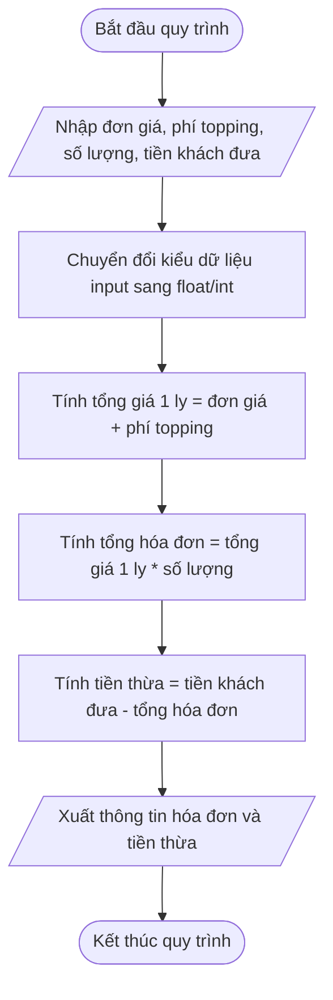

# <center>[Vận dụng cơ bản 6] Sửa lỗi tính tổng tiền hóa đơn order tại quầy Highlands POS</center>

### **1. Mục tiêu**
*   **Kiến thức:** Hiểu rõ cơ chế nhận dữ liệu đầu vào từ người dùng qua hàm `input()` trong Python và bản chất kiểu dữ liệu chuỗi (`str`).
*   **Kỹ năng:** Thao tác chuyển đổi kiểu dữ liệu (Type Casting) bằng `int()` và `float()` để thực hiện chính xác các phép toán số học; áp dụng kỹ năng truy vết mã nguồn (Code Tracing) và sửa lỗi logic (Debugging).
*   **Thực tiễn nghiệp vụ:** Đảm bảo hệ thống POS tại quầy trà sữa/cà phê Highlands POS tính toán chuẩn xác tổng tiền hóa đơn và số tiền thừa trả lại cho khách hàng.

### **2. Bối cảnh & Vấn đề**
Phân hệ thanh toán tại quầy của hệ thống Highlands POS cho phép thu ngân nhập tên món uống, đơn giá cơ bản, phí phụ thu topping, số lượng ly và số tiền khách hàng đưa để in hóa đơn nhanh.

Bộ phận vận hành nhận được phản ánh từ thu ngân cửa hàng: Khi thực hiện order món uống có kèm topping, hệ thống in ra hóa đơn với tổng tiền thanh toán lớn bất thường (lên đến hàng trăm triệu VNĐ), dẫn đến số tiền thừa trả lại khách hàng bị tính toán sai nghiêm trọng làm ngưng trệ ca làm việc.



# **3. Mã nguồn hiện tại**
Dưới đây là mã nguồn xử lý thanh toán hóa đơn đang gặp lỗi logic được bàn giao cho bạn:

```python

# Nhập thông tin order từ bàn phím tại quầy Highlands POS
item_name = input("Nhập tên món uống: ")
unit_price = input("Nhập đơn giá cơ bản (VNĐ): ")
topping_fee = input("Nhập phí topping (VNĐ): ")
quantity = input("Nhập số lượng ly: ")
cash_given = input("Nhập số tiền khách đưa (VNĐ): ")

# Tính toán chi phí cho từng ly đồ uống
price_per_item = unit_price + topping_fee

# Tính tổng tiền hóa đơn và số tiền thừa trả khách
total_bill = float(price_per_item) * int(quantity)
change_due = float(cash_given) - total_bill

# Xuất kết quả hóa đơn
print("--- HÓA ĐƠN HIGHLANDS POS ---")
print("Tên món:", item_name)
print("Tổng tiền hóa đơn:", total_bill, "VNĐ")
print("Tiền thừa trả khách:", change_due, "VNĐ")
```

# **4. Yêu cầu bài toán**

#### **Phần 1: Phân tích & Báo cáo Test Case (Code Tracing)**
Thực hiện chạy thử mã nguồn, truy vết biến để tìm ra dòng mã gây lỗi. Hoàn thiện bảng báo cáo kịch bản kiểm thử (Test Case Report Table) theo mẫu bên dưới (dòng STT 1 là ví dụ mẫu, bạn cần hoàn thành STT 2 và STT 3):

<table style="width: 100%; min-width: 100%; display: table; border-collapse: collapse;" width="100%" border="1">
  <thead>
    <tr style="background-color: #f2f2f2;">
      <th style="padding: 8px; text-align: center;">STT</th>
      <th style="padding: 8px; text-align: center;">Dữ liệu đầu vào (Input)</th>
      <th style="padding: 8px; text-align: center;">Kết quả lỗi (Buggy Output)</th>
      <th style="padding: 8px; text-align: center;">Kết quả mong đợi (Expected Output)</th>
      <th style="padding: 8px; text-align: center;">Dòng code gây lỗi</th>
      <th style="padding: 8px; text-align: center;">Giải thích nguyên nhân (Logic Note)</th>
    </tr>
  </thead>
  <tbody>
    <tr>
      <td style="padding: 8px; text-align: center;">1</td>
      <td style="padding: 8px;">unit_price = "45000"<br>topping_fee = "8000"<br>quantity = "2"<br>cash_given = "150000"</td>
      <td style="padding: 8px;">total_bill = 900016000.0<br>change_due = -899866000.0</td>
      <td style="padding: 8px;">total_bill = 106000.0<br>change_due = 44000.0</td>
      <td style="padding: 8px; text-align: center;">Dòng 8</td>
      <td style="padding: 8px;">Do unit_price và topping_fee đều là kiểu chuỗi (str), toán tử + thực hiện nối chuỗi thành "450008000" trước khi ép kiểu float(), dẫn đến tính sai tổng tiền.</td>
    </tr>
    <tr>
      <td style="padding: 8px; text-align: center;">2</td>
      <td style="padding: 8px;">unit_price = "55000"<br>topping_fee = "10000"<br>quantity = "1"<br>cash_given = "100000"</td>
      <td style="padding: 8px;">...</td>
      <td style="padding: 8px;">...</td>
      <td style="padding: 8px; text-align: center;">...</td>
      <td style="padding: 8px;">...</td>
    </tr>
    <tr>
      <td style="padding: 8px; text-align: center;">3</td>
      <td style="padding: 8px;">unit_price = "39000"<br>topping_fee = "0"<br>quantity = "3"<br>cash_given = "200000"</td>
      <td style="padding: 8px;">...</td>
      <td style="padding: 8px;">...</td>
      <td style="padding: 8px; text-align: center;">...</td>
      <td style="padding: 8px;">...</td>
    </tr>
  </tbody>
</table>

#### **Phần 2: Sửa lỗi mã nguồn (Source Code Correction)**
*   Tiến hành sửa lại đoạn mã nguồn Python sao cho tất cả các giá trị số (`unit_price`, `topping_fee`, `quantity`, `cash_given`) được chuyển đổi kiểu dữ liệu (`float` hoặc `int`) chính xác ngay khi nhập hoặc trước khi tính toán đại số.
*   Đảm bảo chương trình in đúng thông tin hóa đơn với định dạng rõ ràng, chính xác số tiền tổng và tiền thừa.

### **5. Yêu cầu nộp bài**
Học viên cần nộp:
*   Phần phân tích/báo cáo bảng Test Case và mã nguồn triển khai đã sửa lỗi.
*   Đẩy mã nguồn lên GitHub theo định dạng thư mục: `[Tên Lớp]_[Môn Học]_SessionSESSION_01_Ex6`.
    Ví dụ: `HNKS25CNTT1_Core_Session_SESSION_01_Ex6`
